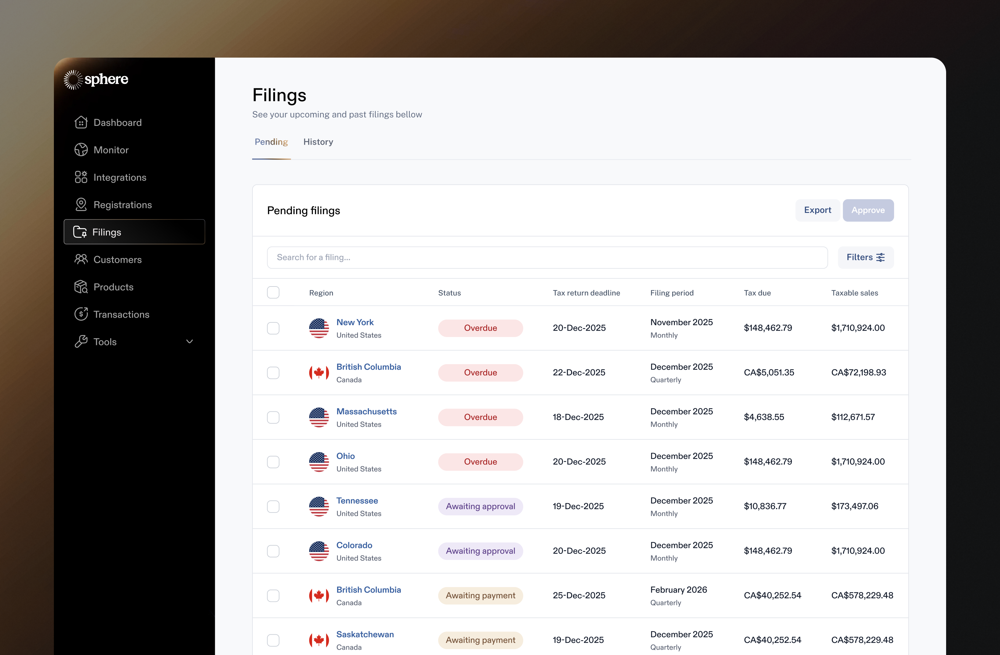
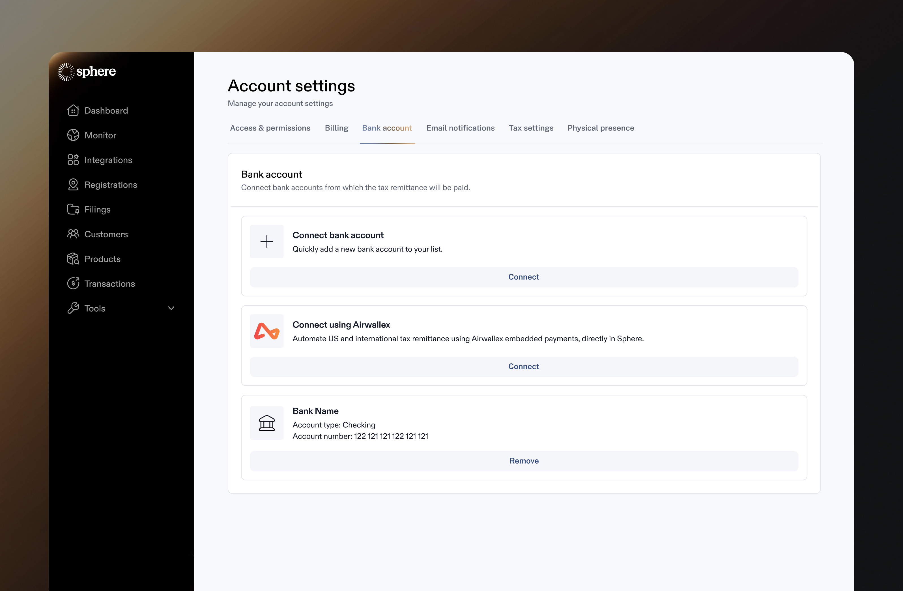
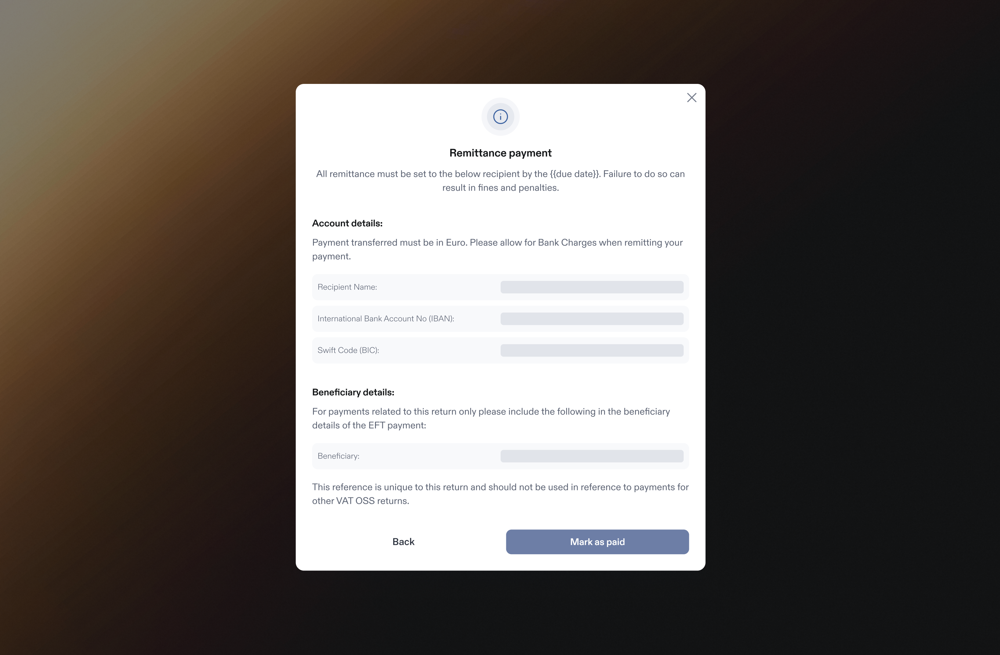

# Filing & Remittance


Walkthrough of the Filings feature in Sphere


## Overview&#x20;

Our Filing feature will generate returns for you and, once approved, we'll submit the data to the relevant tax authority.&#x20;

Our Remittance feature ensures that the amount you owe in each return is sent to the relevant authority in question.&#x20;

## **Filing**&#x20;

Each region will have a specified filing frequency that will vary depending on the amount of volume you do in that region:

* Annual - usually denotes low volume and hence a large reporting periods
* Semi annual - this frequency is less common across regions but does appear in some US states&#x20;
* Quarterly - most common along with Monthly
* Monthly - highest volume and hence shorter reporting requirements&#x20;

Note that while you may start on one frequency, you may be moved to a more regular frequency as you grow.

The due date for a filing will vary by region but they are usually either on the 20th day after the end of the reporting period OR the last day of the month after the end of the reporting period.&#x20;

Sphere will generate your filings _**two weeks before the alloted due date**_ so that you have plenty of time to approve the return. When a filing is released it will appear in the Filings section of the Sphere app in the _Pending Filings_ table.

<figure><figcaption></figcaption></figure>

Filings will also have a status assigned to them based on their standing:

<table><thead><tr><th width="171">Status</th><th width="579">Description</th></tr></thead><tbody><tr><td></td><td>Requires review and approval from the account owner before return can be submitted </td></tr><tr><td></td><td>Requires review / approval AND the due date for the return has already passed</td></tr><tr><td></td><td>Return has been reviewed / approved and is waiting on client for payment (note this is only relevant for international regions)</td></tr><tr><td></td><td>Return has been reviewed / approved and Sphere is processing your return with the tax authority</td></tr><tr><td></td><td>Return has been successfully submitted with the tax authority</td></tr><tr><td></td><td>Return has been successfully submitted with the tax authority but it was submitted after the due date</td></tr></tbody></table>

&#x20;

## **Remittance**

### :flag\_us: US

Sphere provides the ability to auto remit tax payments from the bank account of your choosing. You can submit these bank details in your Account Settings or send a bank letter to the Sphere team via your dedicated Slack channel

<figure><figcaption>
Account setting
</figcaption></figure>

### :earth\_americas:  Rest of World&#x20;

For international jurisdictions, Sphere currently provides all necessary wire details to be able to send tax payments to international tax authorities.&#x20;

<figure><figcaption>
Remittance payment
</figcaption></figure>

We are currently working on an embedded tax remittance feature that will allow customers to send tax payments internationally directly through Sphere. This will be available by Q2 2025.

&#x20;

## **Carryforward**

Carryforward is the industry-standard way of handling net negative liabilities within a tax return. Rather than reporting a negative liability to the tax authorities, Sphere will "carry forward" that negative liability into a future return where it can offset a positive liability. There are two ways that carryforward adjustments can impact your liability within a return:

### Generated

When carryforward is generated, we remove a negative liability from the return (such as a refund or past period cancellation), which **increases** your overall liability for that filing period.

### Applied

When carryforward is applied, we include a negative liability from a previous return, which **decreases** your overall liability for that filing period.
