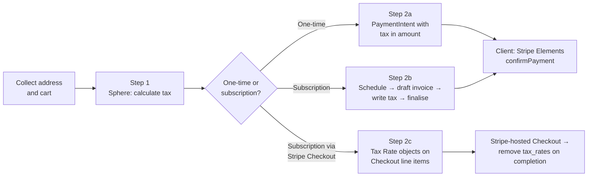
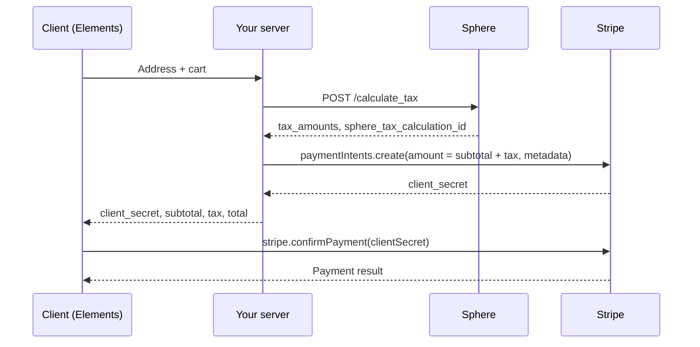
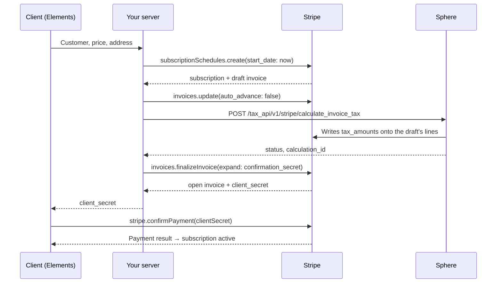

# Custom Checkout with Stripe Elements

To create a custom checkout session with taxes calculated using the Sphere API, follow these steps:

1. Call the Sphere Tax Calculation API to retrieve applicable tax rates.
2. Develop a custom payment form using Stripe Elements, either for one-time payments (Step 3a) or subscriptions (Step 3b), and link the Stripe tax rates obtained from the Sphere API calculations.

## Custom Checkout with Stripe Elements

Stripe Elements are Stripe's pre-built, customisable UI components for collecting payment details. This guide shows how to add Sphere tax calculation to a custom checkout built on Elements, so the amount your customer pays includes the right tax and the resulting Stripe records carry Sphere's calculation.

There are two flows, depending on what you are selling:

| You are charging for…                       | Stripe object                                      | Where Sphere's tax goes                                                       | Section |
| ------------------------------------------- | -------------------------------------------------- | ----------------------------------------------------------------------------- | ------- |
| A one-time purchase                         | PaymentIntent                                      | The PaymentIntent `amount`                                                    | Step 2a |
| A subscription                              | Subscription (created via a Subscription Schedule) | `tax_amounts` on the first invoice's line items                               | Step 2b |
| A subscription sold through Stripe Checkout | Checkout Session, `mode: 'subscription'`           | Stripe Tax Rate objects on `line_items[].tax_rates`, removed after completion | Step 2c |

Both flows start with the same call to Sphere (Step 1) and end with the same Stripe Elements confirmation on the client.



***

### Prerequisites


**Stripe automatic tax must be off** on your account and on every subscription, invoice and Checkout Session. Stripe's automatic tax and Sphere cannot both apply to an invoice.


1. A Sphere API key and the setup described in Tax Calculation: products with Product Tax Codes, and registrations for the regions you sell into.
2. A Stripe integration on API version `2025-03-31.basil` or later. Field names in this guide (`confirmation_secret`, `lines[].pricing`) follows the current Stripe API version, `2026-08-26.dahlia`.
3. The customer's full billing address before you create the payment. By default the Payment Element collects only a postal code and country; use the [Address Element](https://docs.stripe.com/elements/address-element) or set the Payment Element's `fields.billingDetails.address` to `full`.

***

### Step 1: Calculate tax with Sphere

Call the Tax Calculation API with the customer's address and the items in the cart. The response gives you the tax per line, broken down by jurisdiction, and a `sphere_tax_calculation_id` that you store on the Stripe object so Sphere can match the calculation to the payment or invoice.



```javascript
const res = await fetch('https://server.getsphere.com/tax_api/calculate_tax', {
  method: 'POST',
  headers: { 'Content-Type': 'application/json', 'X-API-KEY': process.env.SPHERE_API_KEY },
  body: JSON.stringify({
    customer_id: customerId,                       // Prefix: cus_...
    // { address1, city, state, postal_code, country }
    customer_address: address,                     
    line_items: cart.map((item) => ({
      id: item.id,
      amount: item.amount,                         // cents
      product_id: item.productId,                  // Prefix: prod_...
    })),
    currency: 'usd',
  }),
});
const { data: tax } = await res.json();
```



```json
POST https://server.getsphere.com/tax_api/calculate_tax
X-API-KEY: sk_sphere_...

{
  "customer_id": "cus_RQx5PQDFSMH6Ku",
  "customer_address": {
    "address1": "Investors Boulevard",
    "city": "Myrtle Beach",
    "state": "SC",
    "postal_code": "29579",
    "country": "US"
  },
  "line_items": [
    { "id": "line_1", "amount": 10000, "product_id": "prod_RArEhwhXLfX5jF" }
  ],
  "currency": "usd"
}
```



```json
{
  "message": "Tax calculated successfully",
  "data": {
    "lines": [
      {
        "id": "line_1",
        "tax_amounts": [
          {
            "amount": 600,
            "taxable_amount": 10000,
            "tax_rate": {
              "percentage": 6.0,
              "inclusive": false,
              "display_name": "Sales Tax",
              "jurisdiction": "South Carolina",
              "country": "US",
              "state": "SC",
              "tax_type": "sales_tax"
            }
          }
        ]
      }
    ],
    "sphere_tax_calculation_id": "cfd1e35a-ccb8-4bf1-86ed-49e332be220b"
  }
}
```



For business customers pass `tax_id` (and `include_taxability_reason: true` to see when a reverse charge applied). Field-by-field detail, tax IDs and error codes are on the Tax Calculation page.

***

### Step 2a: One-time payment

A PaymentIntent has no invoice or line items, so tax goes into the `amount`. Your server adds Sphere's tax to the subtotal, creates the PaymentIntent, and records the calculation id in `metadata`.

**What we will do**

1. The client sends the customer's address and cart to your server.
2. The server calls Sphere (Step 1) and sums the returned `tax_amounts`.
3. Server creates a PaymentIntent whose `amount` is subtotal + tax, with `sphere_tax_calculation_id` in `metadata`.
4. Server returns the `client_secret` plus subtotal, tax and total for display.
5. Client shows the breakdown and confirms with the Payment Element. Tax is paid as part of the single charge.



**Server**



```javascript
app.post('/create-payment-intent', async (req, res) => {
  // 1. Address and cart from the client
  const { customerId, address, cart } = req.body;

  // 2. Calculate tax with Sphere (Step 1) and total it
  const tax = await calculateTax({ customerId, address, cart });
  const subtotal = cart.reduce((sum, item) => sum + item.amount, 0);
  const taxTotal = tax.lines
    .flatMap((line) => line.tax_amounts)
    .reduce((sum, t) => sum + t.amount, 0);

  // 3. PaymentIntent for subtotal + tax, calculation id in metadata
  const paymentIntent = await stripe.paymentIntents.create({
    amount: subtotal + taxTotal,
    currency: 'usd',
    customer: customerId,
    automatic_payment_methods: { enabled: true },
    metadata: {
      sphere_tax_calculation_id: tax.sphere_tax_calculation_id,
      sphere_tax_amount: String(taxTotal),
    },
  });

  // 4. Return the client_secret and breakdown
  res.json({ clientSecret: paymentIntent.client_secret, subtotal, tax: taxTotal, total: subtotal + taxTotal });
});
```



```json
POST https://api.stripe.com/v1/payment_intents

{
  "amount": 10600,
  "currency": "usd",
  "customer": "cus_RQx5PQDFSMH6Ku",
  "automatic_payment_methods": { "enabled": true },
  "metadata": {
    "sphere_tax_calculation_id": "cfd1e35a-ccb8-4bf1-86ed-49e332be220b",
    "sphere_tax_amount": "600"
  }
}
```



```json
{
  "id": "pi_3QKx1yLSmZDVqIUd0a1b2c3d",
  "object": "payment_intent",
  "amount": 10600,
  "currency": "usd",
  "customer": "cus_RQx5PQDFSMH6Ku",
  "status": "requires_payment_method",
  "client_secret": "pi_3QKx1yLSmZDVqIUd0a1b2c3d_secret_…",
  "automatic_payment_methods": { "enabled": true, "allow_redirects": "always" },
  "metadata": {
    "sphere_tax_calculation_id": "cfd1e35a-ccb8-4bf1-86ed-49e332be220b",
    "sphere_tax_amount": "600"
  }
}
```

_Trimmed to the fields this guide uses._



**Client**

Show the subtotal, tax and total your server returned, then confirm as in [Stripe's quickstart](https://docs.stripe.com/payments/quickstart):

```javascript
const { error } = await stripe.confirmPayment({
  elements,
  clientSecret,
  confirmParams: { return_url: 'https://example.com/order/complete' },
});
```


If the address changes before payment, call Sphere again and update the PaymentIntent (`stripe.paymentIntents.update(id, { amount, metadata })`). The amount can be changed until the payment is confirmed.


***

#### Step 2b: Subscription

Stripe finalises the first invoice of a subscription inside the `subscriptions.create` call, before tax can be added. Creating the subscription through a **Subscription Schedule** starting now gives you the first invoice as a draft: Sphere writes the tax onto its lines, your server finalises it and returns the payment `client_secret` to the client exactly as in Stripe's standard Elements flow.

**What we will do**

1. Create the subscription through a Subscription Schedule with `start_date: 'now'`. This creates a real Subscription and its first invoice, but the invoice is a **draft** rather than finalised.
2. Set `auto_advance: false` on the draft so Stripe does not finalise it while you work (it would otherwise do so after about an hour).
3. Call Sphere with the invoice id. Sphere reads the draft, calculates tax from its line items and the customer's address, and writes the result onto each line as `tax_amounts`. No Tax Rate objects are created, and `sphere_tax_calculation_id` is recorded on the invoice's metadata.
4. Finalise the invoice and read its `confirmation_secret`.
5. Client confirms with the Payment Element exactly as in Stripe's standard subscription flow; on payment the subscription is active and later renewals are taxed by Sphere's webhook.



**Server**



```javascript
app.post('/create-subscription', async (req, res) => {
  const { customerId, priceId, address } = req.body;

  try {
    // Update the customer's details if you haven't already
    await stripe.customers.update(customerId, { address });

    // 1. Create via a Schedule so the first invoice is a draft, not finalised
    const schedule = await stripe.subscriptionSchedules.create({
      customer: customerId,
      start_date: 'now',
      end_behavior: 'release',
      phases: [{ items: [{ price: priceId }], duration: { interval: 'month', interval_count: 12 } }],
      default_settings: { collection_method: 'charge_automatically' },
      expand: ['subscription.latest_invoice'],
    });
    const subscription = schedule.subscription;
    const invoice = subscription.latest_invoice;

    // 2. Hold the draft to stop Stripe auto-finalising
    await stripe.invoices.update(invoice.id, { auto_advance: false });

    // 3. Sphere calculates the tax and writes it onto the draft's lines
    const response = await fetch('https://server.getsphere.com/tax_api/v1/stripe/calculate_invoice_tax', {
      method: 'POST',
      headers: { 'Content-Type': 'application/json', 'X-API-KEY': process.env.SPHERE_API_KEY },
      body: JSON.stringify({
        external_id: invoice.id,                          // Prefix: in_...
      }),
    });
    if (!response.ok) throw new Error(`Sphere returned ${response.status}`);

    // 4. Finalise and get the client_secret
    const finalized = await stripe.invoices.finalizeInvoice(invoice.id, {
      expand: ['confirmation_secret'],
    });

    // 5. Client confirms the secret
    res.json({ subscriptionId: subscription.id, clientSecret: finalized.confirmation_secret.client_secret });
  } catch (error) {
    res.status(400).json({ error: { message: error.message } });
  }
});
```



**1. Create the schedule**

```json
POST https://api.stripe.com/v1/subscription_schedules

{
  "customer": "cus_RQx5PQDFSMH6Ku",
  "start_date": "now",
  "end_behavior": "release",
  "phases": [
    { "items": [{ "price": "price_1QJqxTLSmZDVqIUdAbCdEfGh" }],
      "duration": { "interval": "month", "interval_count": 12 } }
  ],
  "default_settings": { "collection_method": "charge_automatically" },
  "expand": ["subscription.latest_invoice"]
}
```

**2. Hold the draft**

```json
POST https://api.stripe.com/v1/invoices/in_1QKx2ALSmZDVqIUdXyZ12345

{ "auto_advance": false }
```

**3. Sphere** - the invoice id, and the connected account when you have more than one:

```json
POST https://server.getsphere.com/tax_api/v1/stripe/calculate_invoice_tax
X-API-KEY: sph_...

{
  "external_id": "in_1QKx2ALSmZDVqIUdXyZ12345",
  "stripe_account_id": "acct_1UBi4z9HkNdRqFv2"
}
```

**4. Finalise**

```json
POST https://api.stripe.com/v1/invoices/in_1QKx2ALSmZDVqIUdXyZ12345/finalize

{ "expand": ["confirmation_secret"] }
```



**1. Schedule -** note the invoice is a `draft` with `auto_advance: true`:

```json
{
  "id": "sub_sched_1QKx2ALSmZDVqIUdSched001",
  "object": "subscription_schedule",
  "status": "active",
  "end_behavior": "release",
  "subscription": {
    "id": "sub_1QKx2ALSmZDVqIUdSub00001",
    "object": "subscription",
    "status": "active",
    "schedule": "sub_sched_1QKx2ALSmZDVqIUdSched001",
    "latest_invoice": {
      "id": "in_1QKx2ALSmZDVqIUdXyZ12345",
      "object": "invoice",
      "status": "draft",
      "auto_advance": true,
      "billing_reason": "subscription_create",
      "collection_method": "charge_automatically",
      "currency": "usd",
      "subtotal": 10000,
      "total": 10000,
      "lines": {
        "data": [
          {
            "id": "il_1QKx2ALSmZDVqIUdLine0001",
            "object": "line_item",
            "amount": 10000,
            "quantity": 1,
            "pricing": {
              "type": "price_details",
              "price_details": { "price": "price_1QJqxTLSmZDVqIUdAbCdEfGh", "product": "prod_RArEhwhXLfX5jF" }
            },
            "taxes": []
          }
        ]
      }
    }
  }
}
```

**2. Invoice** - `"auto_advance": false`, still `"status": "draft"`.

**3. Sphere** - `status` is `applied` when tax was written, `unchanged` when the invoice already carries the same calculation, and `no_tax` when none applies. All three are safe to finalise:

```json
{
  "external_id": "in_1QKx2ALSmZDVqIUdXyZ12345",
  "stripe_account_id": "acct_1UBi4z9HkNdRqFv2",
  "status": "applied",
  "reason": "Tax was calculated and written to the invoice.",
  "calculation_id": "cfd1e35a-ccb8-4bf1-86ed-49e332be220b"
}
```

_The invoice's lines now carry the tax; the `display_name`, `percentage` and `jurisdiction` Sphere sent appear on the customer's invoice._

**4. Finalised invoice**

```json
{
  "id": "in_1QKx2ALSmZDVqIUdXyZ12345",
  "object": "invoice",
  "status": "open",
  "auto_advance": false,
  "subtotal": 10000,
  "total_taxes": [{ "amount": 600, "taxable_amount": 10000, "type": "tax_rate_details" }],
  "total": 10600,
  "amount_due": 10600,
  "confirmation_secret": {
    "client_secret": "pi_3QKx2CLSmZDVqIUd0d4e5f6g_secret_…",
    "type": "payment_intent"
  },
  "parent": {
    "type": "subscription_details",
    "subscription_details": { "subscription": "sub_1QKx2ALSmZDVqIUdSub00001" }
  }
}
```

_All responses trimmed to the fields this guide uses._



**Client**

Unchanged from [Stripe's subscription guide](https://docs.stripe.com/billing/subscriptions/build-subscriptions?payment-ui=elements): mount the Payment Element and call `stripe.confirmPayment` with the `clientSecret`. When payment succeeds the subscription is active.


**Schedule settings.** `end_behavior: 'release'` with a 12-month duration leaves a plain subscription after a year; call `subscriptionSchedules.release` after finalising if you want that immediately. Step 2 is required: the draft is created with `auto_advance: true` and Stripe would otherwise finalise it after about an hour, with or without tax.



If the invoice's lines change after tax is written (price, quantity, discount), call Sphere again before finalising. Stripe does not recalculate manual tax amounts.


***

### Step 2c: Subscription via Stripe Checkout

Stripe Checkout creates and finalises the first invoice when the customer completes the hosted page, so there is no draft to write `tax_amounts` onto. Instead, collect the address before creating the session, create Stripe Tax Rate objects from Sphere's response, pass them on the session's line items, and remove them from the subscription as soon as Checkout completes so that renewals are taxed by Sphere.

You will need to be listening to the `checkout.session.completed` webhook for this method, which is the normal way of handling payment success/failure. You'll need to modify your webhook handler so that on `success` , you remove the Stripe Tax Rate objects we create and attach as part of this process. Even though we must use them with the Stripe Hosted Checkout, they prevent Sphere from keeping your tax calculations up to date as the customer and legislation change.

**What we will do**

1. Collect the customer's address.
2. Create a Stripe Tax Rate object to add Tax to the subscription
3. Create the Checkout Session in `subscription` mode
4. Direct the customer to the Stripe Hosted Checkout page.
5. On `checkout.session.completed`, update the subscription for Sphere to maintain your tax calculations.


1. **Collect the address first** (for example with the [Address Element](https://docs.stripe.com/elements/address-element)) and run Step 1.
2. **Create a Tax Rate object** for each `tax_rate` in the response. Specify the tax rate attributes such as percentage, display name, and jurisdiction.



```javascript
// 2. One Tax Rate object per Sphere tax_rate
const taxRate = await stripe.taxRates.create({
  display_name: t.tax_rate.display_name,
  percentage: t.tax_rate.percentage,
  inclusive: t.tax_rate.inclusive,
  jurisdiction: t.tax_rate.jurisdiction,
  country: t.tax_rate.country,
  state: t.tax_rate.state,
  tax_type: t.tax_rate.tax_type,
});
```



```json
POST https://api.stripe.com/v1/tax_rates

{
  "display_name": "Sales Tax",
  "percentage": 6.0,
  "inclusive": false,
  "jurisdiction": "South Carolina",
  "country": "US",
  "state": "SC",
  "tax_type": "sales_tax"
}
```



```json
{
  "id": "txr_1QJqyzLSmZDVqIUdFs615ZB6",
  "object": "tax_rate",
  "active": true,
  "display_name": "Sales Tax",
  "percentage": 6.0,
  "inclusive": false,
  "jurisdiction": "South Carolina",
  "country": "US",
  "state": "SC",
  "tax_type": "sales_tax"
}
```




**Managing Tax Rate objects.** Where possible, consider reusing an existing active rate with the same `percentage`, `jurisdiction`, `country`, `state`, `tax_type` and `inclusive` if you you have one. This will prevent the creation of many Tax Rates in your Stripe account. You can also archive (`active: false`) rates you no longer use.


3. **Create the Checkout Session in `subscription` mode**, with the calculation id on both the session and the subscription. Here we add the Tax Rate ids on each line item and `sphere_tax_calculation_id` on both the session and the subscription, then send the customer to `session.url`.



```javascript
// 3. Checkout Session with the Tax Rate on the line item and the calculation id on session + subscription
const session = await stripe.checkout.sessions.create({
  mode: 'subscription',
  customer: customerId,
  line_items: [{ price: priceId, quantity: 1, tax_rates: [taxRate.id] }],
  success_url: 'https://example.com/success?session_id={CHECKOUT_SESSION_ID}',
  cancel_url: 'https://example.com/checkout',
  metadata: { sphere_tax_calculation_id: tax.sphere_tax_calculation_id },
  subscription_data: { metadata: { sphere_tax_calculation_id: tax.sphere_tax_calculation_id } },
});
res.json({ checkoutUrl: session.url });
```



```json
POST https://api.stripe.com/v1/checkout/sessions

{
  "mode": "subscription",
  "customer": "cus_RQx5PQDFSMH6Ku",
  "line_items": [
    { "price": "price_1QJqxTLSmZDVqIUdAbCdEfGh", "quantity": 1, "tax_rates": ["txr_1QJqyzLSmZDVqIUdFs615ZB6"] }
  ],
  "success_url": "https://example.com/success?session_id={CHECKOUT_SESSION_ID}",
  "cancel_url": "https://example.com/checkout",
  "metadata": { "sphere_tax_calculation_id": "cfd1e35a-ccb8-4bf1-86ed-49e332be220b" },
  "subscription_data": {
    "metadata": { "sphere_tax_calculation_id": "cfd1e35a-ccb8-4bf1-86ed-49e332be220b" }
  }
}
```



```json
{
  "id": "cs_test_a1B2c3D4e5F6g7H8i9J0",
  "object": "checkout.session",
  "mode": "subscription",
  "status": "open",
  "customer": "cus_RQx5PQDFSMH6Ku",
  "url": "https://checkout.stripe.com/c/pay/cs_test_a1B2c3D4e5F6g7H8i9J0#…",
  "amount_subtotal": 10000,
  "total_details": { "amount_tax": 600 },
  "amount_total": 10600,
  "subscription": null,
  "metadata": { "sphere_tax_calculation_id": "cfd1e35a-ccb8-4bf1-86ed-49e332be220b" }
}
```

_`subscription` is populated once the customer completes the page._



4. **Direct the customer to the Stripe Hosted Checkout page.** The Hosted Checkout functions the same way as it normally does, though you will notice the tax being properly calculated and presented to the user.
5. **Remove the rates on completion.** Checkout copies `tax_rates` onto the subscription items, and Stripe would apply them to every renewal.  To ensure Sphere can function the  `checkout.session.completed`, we clear them. The first invoice will still have the Tax Rates attached, but these were correct at time of purchase. Sphere ensures tax rates remain correct on future renewals.



```javascript
// 5. After Checkout completes, strip tax_rates so renewals can be handled by Sphere
if (event.type === 'checkout.session.completed') {
  const session = event.data.object;
  if (session.mode === 'subscription' && session.subscription) {
    const subscription = await stripe.subscriptions.retrieve(session.subscription);
    await Promise.all(
      subscription.items.data.map((item) =>
        stripe.subscriptionItems.update(item.id, { tax_rates: '' })   // '' unsets; [] also accepted by the Node SDK
      )
    );
  }
}
```



```json
POST https://api.stripe.com/v1/subscription_items/si_1QKx3DLSmZDVqIUdItem0001

{ "tax_rates": "" }
```



```json
{
  "id": "si_1QKx3DLSmZDVqIUdItem0001",
  "object": "subscription_item",
  "subscription": "sub_1QKx3DLSmZDVqIUdSub00002",
  "price": { "id": "price_1QJqxTLSmZDVqIUdAbCdEfGh", "product": "prod_RArEhwhXLfX5jF" },
  "quantity": 1,
  "tax_rates": []
}
```




Until step 5 has run, the subscription still carries Tax Rate objects and Sphere cannot write tax onto its renewal invoices. Make the webhook handler idempotent and alert on failures.


***

### Renewals

Nothing to do. Stripe creates each renewal invoice as a draft and holds it for about an hour; Sphere's Stripe integration writes tax onto it during that window, then Stripe finalises and charges as normal. The same applies to post-trial invoices and plan-change credits billed on the next invoice. Keep `automatic_tax` off and Tax Rate objects off your subscriptions, or Sphere's tax cannot be applied. Alternatively your billing system can manually call Sphere at renewal time, for stronger syncronous guarantees.

If you used Step 2c, this depends on the `checkout.session.completed` cleanup having run.

***

### Common "gotchas" to watch out for

| Avoid                                                                                                                 | Why                                                                                                                                                           |
| --------------------------------------------------------------------------------------------------------------------- | ------------------------------------------------------------------------------------------------------------------------------------------------------------- |
| `stripe.subscriptions.create(...)` directly for card-on-file subscriptions                                            | The first invoice is finalised inside the call. Use a Subscription Schedule (Step 2b).                                                                        |
| Attaching Tax Rate objects as `tax_rates` outside Step 2c, or leaving them on a subscription after Checkout completes | Cannot coexist with `tax_amounts` on the same invoice, so Sphere cannot tax renewals; the objects also accumulate in your account unless reused and archived. |
| Enabling `automatic_tax` on any object                                                                                | Mutually exclusive with Sphere on an invoice.                                                                                                                 |
| Relying on the Payment Element's default address collection                                                           | Postal code and country only. Collect the full address first.                                                                                                 |
