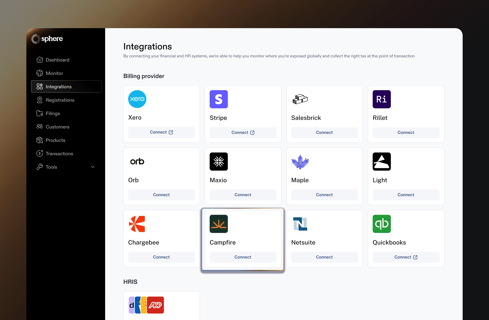
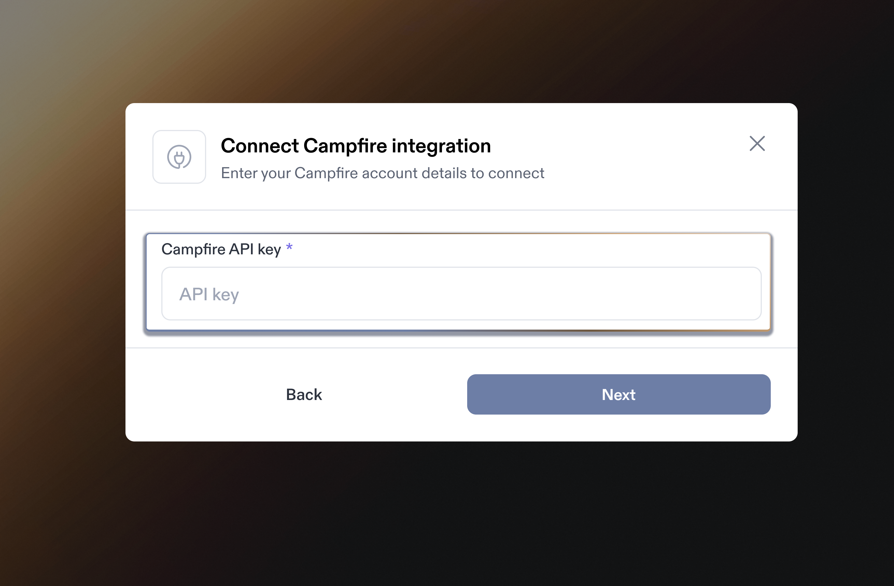
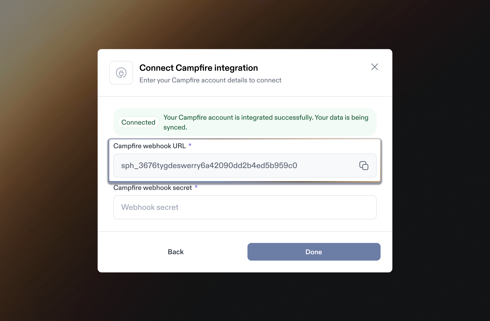
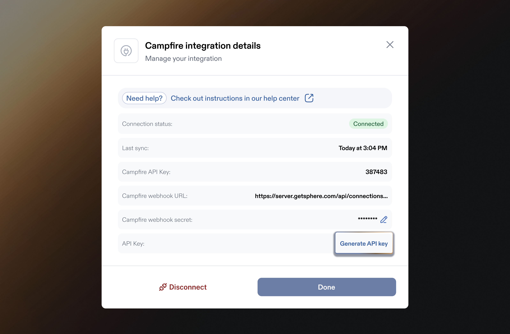

# Campfire Integration

Integrating Campfire with Sphere enables a.) seamless transaction data import and b.) live tax calculation within Campfire invoices.&#x20;

This guide provides step-by-step instructions on generating an API key in Campfire, linking it to Sphere for a secure integration, and setting up a webhook connection between the two platforms.

It also covers configuring the Sphere Tax API within Campfire to ensure accurate tax calculations.

### Part 1: Configure Data Synchronization from Campfire to Sphere

Follow the steps below to get started:

1. In your **Sphere account**, click on the **Connect** button on the Campfire tile.

<figure><figcaption></figcaption></figure>

2. In another window, open your **Campfire Dashboard** and navigate to the **Settings** tab. Click **API Keys** under the Developer section.

<figure><figcaption></figcaption></figure>

3. In the **API Keys** section, click **Create API Key** to generate a new key.

<figure><figcaption></figcaption></figure>

4. Go back to the your **Sphere account** and enter the API key generated in Step 3. Ensure there are no extra spaces before or after the value.

<figure><figcaption></figcaption></figure>

5. Click **Next** to complete the setup. A success message will confirm the connection.
6. Next, you'll proceed with setting up the webhook. Copy the **Campfire Webhook URL**.

<figure><figcaption></figcaption></figure>

7. Return to the **Campfire Dashboard**, go to the **Settings** tab in the left menu, and click **Webhooks**.

<figure><figcaption></figcaption></figure>

8.  Create a new webhook and paste the URL you copied from Step 6. Ensure the "Active" checkbox is selected, enable all invoice-related topics from the list, and click "**Save**" when finished.

    **Enabled topics:**

    * Invoice.created
    * Invoice.updated
    * Invoice.deleted
    * Invoice.payment
    * Invoice.paid
    * CreditMemo.created
    * CreditMemo.updated
    * CreditMemo.deleted

<figure><figcaption></figcaption></figure>

9. Once the webhook is enabled, copy the **HMAC-SHA256** secret in this step.

<figure><figcaption></figcaption></figure>

10. Go back to your Sphere account. In the **Campfire Webhook Secret** input field, paste the **Signing Secret** copied in Part 9, then click **Done**.

<figure><figcaption></figcaption></figure>

11. You’re all set! If the connection is successful, data will begin importing, and after some time, your products will appear in **Sphere**. You'll then need to assign tax codes to each of your products and tax will automatically populate on invoices in regions you are registered and where you've enabled automatic tax calculation.

<figure><figcaption></figcaption></figure>

### Part 2: Create a Sphere Tax API Key for Tax Calculation

**Note:** Currently, the Campfire app does not have a field to input the Sphere API key. To set it up, the API key must be shared with the Campfire team.

1. Click the **"Edit"** button on the Campfire integration card to make changes.

<figure><figcaption></figcaption></figure>

2. This will open a modal displaying the integration details. Click **"Generate API Key"** to create a new key.

<figure><figcaption></figcaption></figure>

3. Follow the steps to create a new API key.

<figure><figcaption></figcaption></figure>

4. Make sure to store the newly generated key securely, as you won’t be able to view it again later. You will need to share this with the Campfire team to set it up for your account.

<figure><figcaption></figcaption></figure>

5. This step is optional; you can revoke an existing key and generate a new one if necessary.

<figure><figcaption></figcaption></figure>

**Tax Calculation Flow**

When creating an invoice, after filling in all the details, you need to manually click the “Apply Tax From Sphere” button in Campfire. Note: After every change to the invoice, remember to click the button again so taxes can be recalculated.

<figure><figcaption></figcaption></figure>

<figure><figcaption></figcaption></figure>

<figure><figcaption></figcaption></figure>
