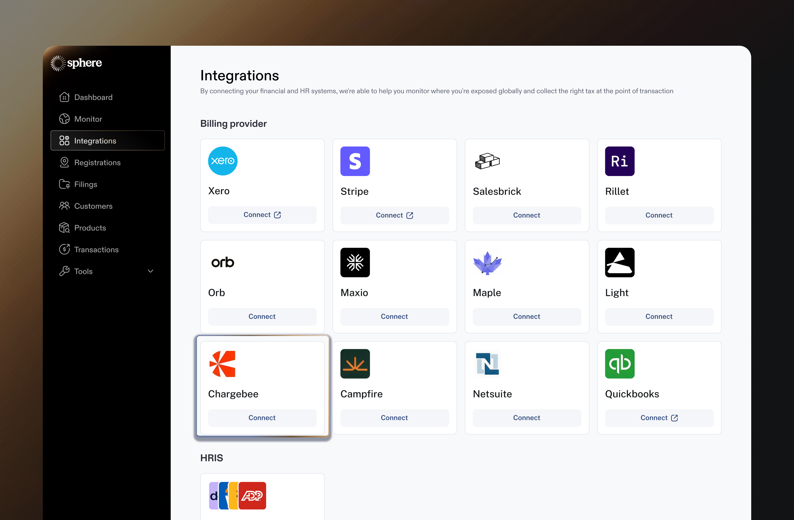
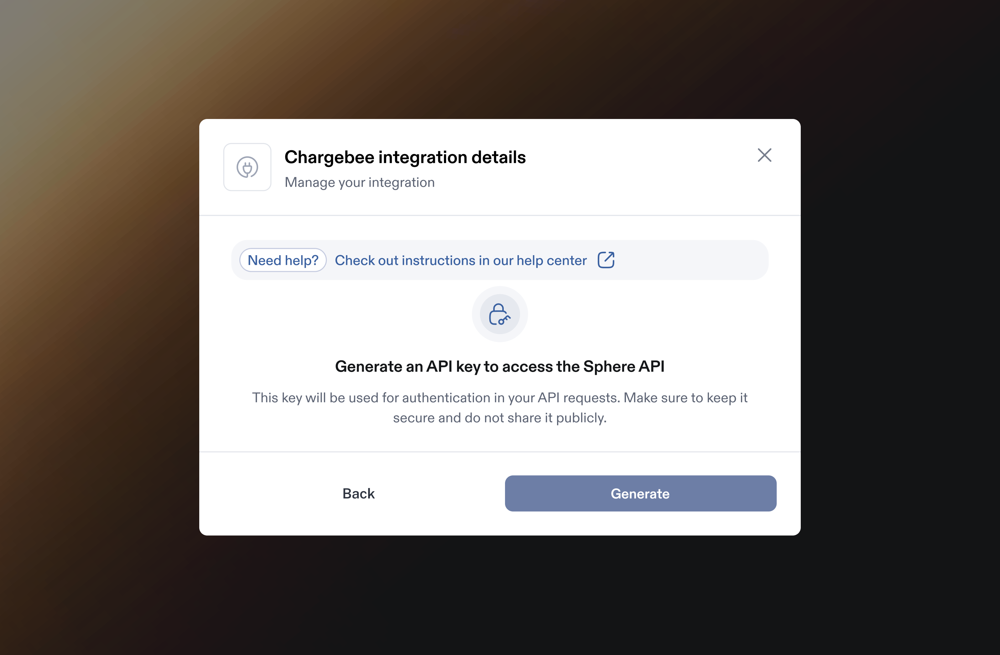

# Chargebee Integration

Integrating Chargebee with Sphere enables a.) seamless transaction data import and b.) live tax calculation within Chargebee invoices. &#x20;

This guide provides step-by-step instructions on generating an API key in Chargebee and connecting it to Sphere for a smooth and secure integration.&#x20;

It also covers configuring the Sphere Tax API within Chargebee to ensure accurate tax calculations.

### Part 1: Configure Data Synchronization from Chargebee to Sphere

**Prerequisite:**\
**Note:** Before proceeding, please confirm with the Chargebee team whether your account is using **Product Catalogue v1.0**. If it is, let us know so we can update the necessary configuration settings.

Follow the steps below to get started:

1. In your Sphere account, click on the **Connect** button on the Chargebee tile.

<figure><figcaption></figcaption></figure>

2. In another window, open your **Chargebee Dashboard** and navigate to the **Settings** tab. Click **Configure Chargebee**.

<figure><figcaption></figcaption></figure>

3. Select **API Keys** from the menu.

<figure><figcaption></figcaption></figure>

4. In the **API Keys and Webhooks** section, click **+ Add API Key** to generate a new key.

<figure><figcaption></figcaption></figure>

5. A modal will appear asking for the key type. Choose **Read-Only Key**.

<figure><figcaption></figcaption></figure>

6. Select the **All** option to grant full read-only access, provide a name for the API key, and click **Create Key**.

<figure><figcaption></figcaption></figure>

7. Go back to your Sphere account and enter the API key generated in Step 5 along with your Chargebee site name, which can be found in your Chargebee URL.
   1. **Example:** _https://getsphere-test.chargebee.com/dashboards_
   2. **Site Name:** _getsphere-test_
   3. Ensure there are no extra spaces before or after the values.

<figure><figcaption></figcaption></figure>

8. Click **Save** to complete the setup. A success message will confirm the connection.
9. If the connection is successful, data will begin importing and your products will appear in Sphere (please provide time for all products to load successfully).

<figure><figcaption></figcaption></figure>

### Part 2: Configure Sphere Tax API Key for Tax Calculation

1. Click the **"Edit"** button on the Chargebee integration card to make changes.

<figure><figcaption></figcaption></figure>

2. This will open a modal displaying the integration details. Click **"Generate API Key"** to create a new key.

<figure><figcaption></figcaption></figure>

3. Follow the steps to create a new API key.

<figure><figcaption></figcaption></figure>

4. Make sure to store the newly generated key securely, as you won’t be able to view it again later.

<figure><figcaption></figcaption></figure>

5.  Please visit the link below to add the Sphere application to your Chargebee account:\
    `https://<domain>.chargebee.com/third_party/tax_providers/sphere/overview`

    Remember to replace `<domain>` with your Chargebee domain URL.\
    For example, in the URL [**https://sphere-test.chargebee.com/dashboards**](https://sphere-test.chargebee.com/dashboards), the domain is **sphere-test**.
6. Click the **"Get Started"** button located in the top right corner.

<figure><figcaption></figcaption></figure>

7. A modal will appear requesting the Sphere Tax API Key. Enter the key you generated in Step 4 of this guide.

<figure><figcaption></figcaption></figure>

8. It will guide you through a few steps. Click **"Proceed"** to continue.

<figure><figcaption></figcaption></figure>

9. In the **Configure Sync Rules** step, enable Chargebee to post invoices and credit notes to Sphere. Then, from the dropdown menu, select the **Commit all invoices and credit notes** option for the second question, and click **Proceed**.

<figure><figcaption></figcaption></figure>

10. Next, you'll need to configure Sphere for the countries where you will be calculating taxes. Click the **Go to Taxes** button to proceed.

<figure><figcaption></figcaption></figure>

11. You will need to define the regions where taxes will be applied. Click the option to **add regions**, and select the appropriate regions or countries for which you intend to calculate taxes.

<figure><figcaption></figcaption></figure>

12. For each region you add, be sure to choose **Sphere taxes** for that region.

<figure><figcaption></figcaption></figure>

13. You’re all set! You can now start creating invoices, and Sphere will automatically apply the taxes.

***

### Set up a connection between your Chargebee test account and Sphere

To integrate your Chargebee test site with Sphere, start by selecting your **test site** from the list of available Chargebee sites during the connection process.

**Note:** Before proceeding, please check with your Sphere representative to confirm that your Sphere test account is properly set up and aligned with your testing requirements.

Once you’ve selected the test site, you’ll notice visual indicators confirming that test mode is active — including:

* A **“test” label in the URL**
* A corresponding **test label in the left-hand navigation menu**

For detailed guidance on identifying and working with test sites, please refer to the official [Chargebee documentation](https://www.chargebee.com/docs/billing/2.0/getting-started/sites-intro). You can then follow the same connection steps as outlined above.

<figure><figcaption></figcaption></figure>

<figure><figcaption></figcaption></figure>
