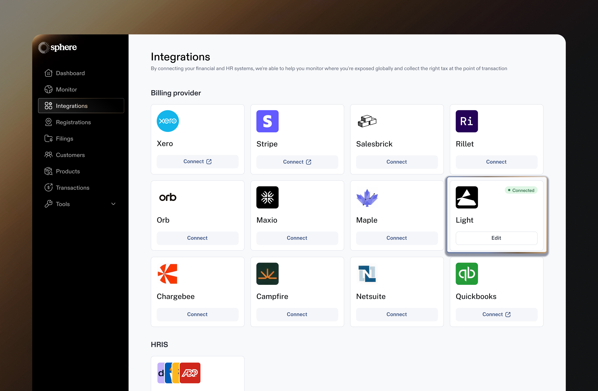

# Light Integration

Integrating Light with Sphere enables:\
a) seamless data imports, and\
b) real-time tax calculation.

This guide walks you through connecting your Light app to Sphere for a seamless, secure integration. It also explains how to generate your Sphere Tax API key within Sphere to enable accurate and reliable tax calculations.

### Part 1: Configure Data Synchronization from Light to Sphere

Follow the steps below to get started:

1. In your Sphere account, click on the **Connect** button on the Light tile.

<figure><figcaption></figcaption></figure>

2. In Light, navigate to **Settings → API Keys** and click **+ Create Key**. Enter a name for the API key and assign it the **Admin** role. After the key is created, click **Copy Key** to copy it to your clipboard. 

<figure><figcaption></figcaption></figure>

3. Navigate back to Sphere, and enter the Light API Key created into Sphere.

<figure><figcaption></figcaption></figure>

3. You’re all set! Once the connection is successful, data will start importing, and your products will appear in Sphere shortly thereafter.

<figure><figcaption></figcaption></figure>

### Part 2: Configure Sphere Tax API Key for Tax Calculation

1. Click the **"Edit"** button on the Light integration card to make changes.

<figure><figcaption></figcaption></figure>

2. This will open a modal displaying the integration details. Click **"Generate API Key"** to create a new key.

<figure><figcaption></figcaption></figure>

3. Follow the steps to generate a new API key. Be sure to store the key securely, as it cannot be viewed again later. You will need to share this key with the Light team so they can configure it in your account.

<figure><figcaption></figcaption></figure>

4. Ensure all your 'Subscribed Regions' in Sphere have 'Tax Calculations' settings switched to Yes (see video [here](https://www.loom.com/share/6254e72b130c44808a59513046ee60ea?sid=463c87f3-0683-4622-a479-0f960620d332) on how to ensure this is done).

<figure><figcaption></figcaption></figure>

***
