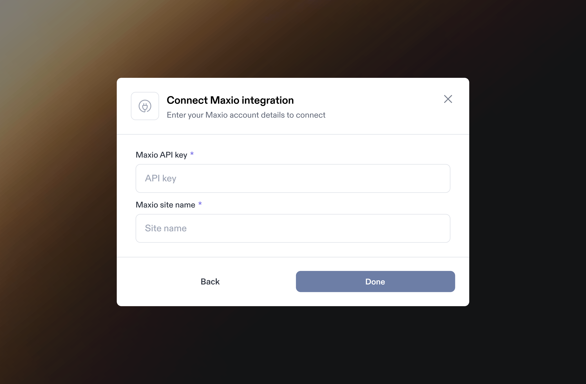
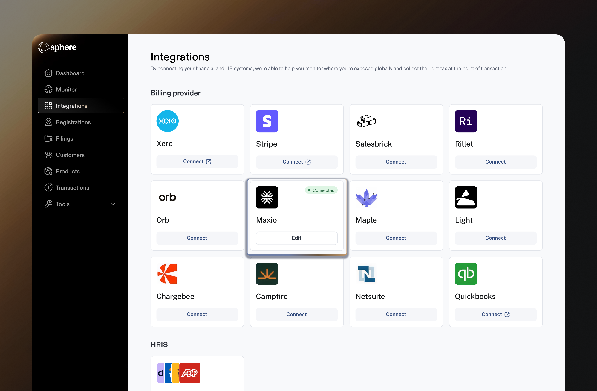
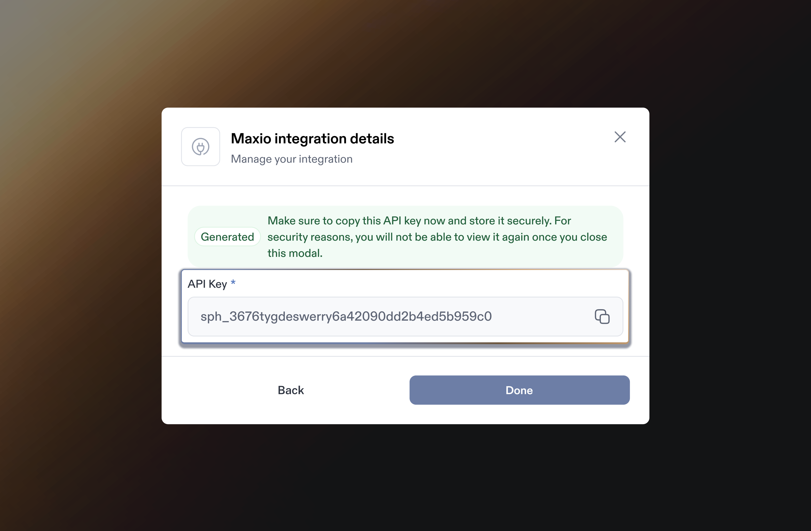

# Maxio Integration

Integrating Maxio with Sphere allows for a) seamless import of transaction data and b) real-time tax calculation on Maxio invoices and credit notes.

This guide provides step-by-step instructions on generating an API key in Maxio and connecting it to Sphere for a smooth and secure integration.&#x20;

It also covers configuring the Sphere Tax API within Maxio to ensure accurate tax calculations.

### Part 1: Configure Data Synchronization from Maxio to Sphere

Follow the steps below to get started:

1. In your Sphere account, click on the **Connect** button on the Maxio tile.

<figure><figcaption></figcaption></figure>

2. In a separate window, open your Maxio Dashboard and go to the **Integrations** tab under the **Config** section in the left navigation bar. Click the **Integrations** button, then select **New API Key** to generate an API key in Maxio.

<figure><figcaption></figcaption></figure>

3. Create the API key in Maxio and save it securely. Be sure to copy it somewhere safe, as you won’t be able to view it again later.

<figure><figcaption></figcaption></figure>

<figure><figcaption></figcaption></figure>

4. Return to your Sphere account and enter the API key generated in Step 3 along with your Maxio site name, which you can find in your Maxio URL.\
   a. Example: `https://sphere-sandbox.chargify.com`\
   b. Site Name: `sphere-sandbox`\
   c. Make sure there are no extra spaces before or after the values.\
   d. Click **Next**.

<figure><figcaption></figcaption></figure>

5. Next, set up a webhook connection with Maxio to receive live updates. Start by copying the Maxio Webhook URL from Sphere.

<figure><figcaption></figcaption></figure>

<figure><figcaption></figcaption></figure>

6. In Maxio, go to **Settings** in the main menu, then select **Webhooks** from the options. Once there, click on the **Add New Endpoint** button to create a new webhook. This will allow you to configure the connection to receive live updates from Sphere.

<figure><figcaption></figcaption></figure>

7. Enter the webhook URL you copied from Sphere into Maxio. Then, under **Webhook Subscriptions**, select the following events:\
   a. Payment Success\
   b. Customer Update\
   c. Customer Create\
   d. Invoice Issued

Once you’ve selected these, click **Save** to finalize the webhook setup.

<figure><figcaption></figcaption></figure>

8. To obtain the webhook secret in Maxio, hover over the selected site in the left navigation bar. When the popup menu appears, click **Edit Current Site** from the options.

<figure><figcaption></figcaption></figure>

9. You’ll be taken to the site-specific settings page. Locate the **Shared Key** section on this page, then copy the value provided. Paste this key into Sphere under the **Maxio Webhook Secret** field.

<figure><figcaption></figcaption></figure>

<figure><figcaption></figcaption></figure>

10. You’re all set! If the connection is successful, data will begin importing, and after some time, your products will appear in **Sphere**.

<figure><figcaption></figcaption></figure>

### Part 2: Configure Sphere Tax API Key for Tax Calculation

1. Click the **"Edit"** button on the Maxio integration card to make changes.

<figure><figcaption></figcaption></figure>

2. This will open a modal displaying the integration details. Click **"Generate API Key"** to create a new key.

<figure><figcaption></figcaption></figure>

3. Follow the steps to create a new API key. Make sure to store the newly generated key securely, as you won’t be able to view it again later.

<figure><figcaption></figcaption></figure>

**Note:** Sphere does not currently support tax calculation for Maxio transactions. Our team is actively working on integrating this functionality, and we appreciate your patience as we develop this feature. We will provide updates as soon as tax calculation support becomes available.

***

### Set up a connection between your Maxio test account and Sphere

To integrate your Maxio test site with Sphere, begin by selecting your test site from the list of available Maxio sites during the connection process. If you don’t have a test site yet, you can create a new one.

\
**Note:** Before continuing, please consult your Sphere representative to ensure your Sphere test account is correctly configured and meets your testing needs.
