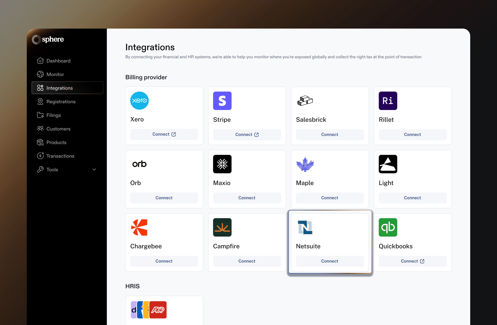
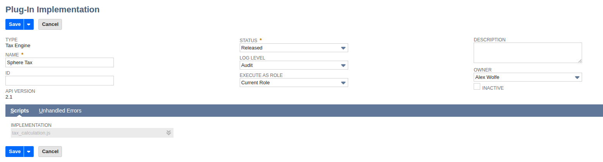

# NetSuite Integration

Integrating NetSuite with Sphere enables:

* **Live tax calculation** within NetSuite invoices and credit memos via the SuiteTax plugin
* **Transaction data sync** from NetSuite into Sphere for filing and compliance

This guide walks through installing the Sphere SuiteApp, configuring tax calculation, and connecting your NetSuite account to Sphere.

<figure><figcaption></figcaption></figure>

***

### Prerequisites

Before installing, ensure the following features are enabled in your NetSuite account.

#### Enable SuiteCloud Features

Navigate to **Setup > Company > Enable Features**. In the **SuiteCloud** tab:

* Under **SuiteBuilder**: check **Custom Records**
* Under **SuiteScript**: check **Client SuiteScript** and **Server SuiteScript**
* Under **SuiteTalk (Web Services)**: check **REST Web Services**
* Under **Manage Authentication**: check **OAuth 2.0**

Click **Save**.

<figure><figcaption></figcaption></figure>

#### Enable SuiteTax

On the same **Enable Features** page, go to the **Tax** tab:

1. Check **SuiteTax**
2. Under **Related SuiteApps**, install:
   * **SuiteTax Engine** — click Install
   * **SuiteTax Data Records** — click Install
   * **SuiteTax Reports** — click Install
3. Check **SuiteTax Plug-in**
4. Click **Save**

> **Important:** Enabling SuiteTax is permanent and cannot be reversed. If you see a Site Builder error, follow NetSuite's guides to [disable Site Builder](https://docs.oracle.com/en/cloud/saas/netsuite/ns-online-help/section_N2755498.html) and [inactivate websites](https://docs.oracle.com/en/cloud/saas/netsuite/ns-online-help/section_N2898498.html) first.

***

<figure><figcaption></figcaption></figure>

#### Confirm SuiteTax Setup

If your account has existing taxable transactions, NetSuite will migrate them to the SuiteTax format. After migration completes:

1. Navigate to **Setup > Tax > Confirm SuiteTax Setup** (or click the **Confirm SuiteTax Setup** button on the SuiteTax Migration page)
2. Check the **SuiteTax Setup Completed** checkbox
3. Click **Save**

> **Note:** Taxable transactions cannot be created or edited until this step is completed. This step may not appear on new accounts with no prior transactions.

<figure><figcaption></figcaption></figure>

***

### Installing the Sphere SuiteApp

Search for **SuiteApp Marketplace** in the NetSuite global search. In the marketplace, search for **Sphere Tax** and click Install.

The SuiteApp ID is `com.getsphere.spheretax`.

This installs:

* The tax calculation plugin script (`tax_calculation.js`)
* Sphere Configuration and Tax Code Mapping custom records
* A default sales tax item
* The Sphere Tax integration record

***

### Data Synchronization

To sync transaction data from NetSuite to Sphere for filing and compliance, connect your NetSuite account through the Sphere dashboard.

> **Supported transaction types:** Sphere currently syncs invoices and credit memos from NetSuite. Support for additional transaction types (cash sales, cash refunds, sales orders) is coming soon.

#### Connect NetSuite to Sphere

1. In the **Sphere dashboard**, navigate to **Settings > Integrations**
2. Select **NetSuite** and click **Connect**
3. Enter your **NetSuite Account ID** (found at Setup > Company > Company Information)
4. You will be redirected to NetSuite to authorize Sphere
5. After authorizing, you'll be redirected back to the Sphere dashboard

#### Select a Subsidiary

If your NetSuite account has multiple subsidiaries (OneWorld), you'll see a **Select Subsidiary** screen after connecting. Choose the subsidiary that represents the legal entity registered with the tax authority, then click **Continue**.

If your account has a single subsidiary, this step is handled automatically.


Sphere scopes its transaction sync and tax calculations to a single subsidiary. Selecting the correct subsidiary ensures that only transactions belonging to that legal entity are imported, and that tax is calculated against the right jurisdictional registrations.


***

### Live Tax Calculation

> **Contact our team before enabling live tax calculation.** This section configures Sphere to calculate sales tax in real-time on NetSuite transactions. If you're only using Sphere for filing/compliance (data sync), you can skip this section.

#### Step 1: Create the Plugin Implementation Record

This step connects the installed script file to NetSuite's SuiteTax plugin framework. It must be done manually — this is a NetSuite platform limitation that affects all SuiteTax engine providers.

<figure><figcaption></figcaption></figure>

1. Navigate to **Customization > Plug-ins > Plug-In Implementations**
2. Click **New Plug-In Implementation**
3. For the script file, select `tax_calculation.js` from the SuiteApps folder: `SuiteApps / com.getsphere.spheretax / tax_calculation.js`
4. Click **Create Plug-In Implementation**
5. Fill in:
   * **Name**: Sphere Tax
   * **Status**: **Released** (not "Testing")
6. Verify the **Scripts** subtab shows `tax_calculation.js` in the **IMPLEMENTATION** field (should be auto-populated)
7. Click **Save**

> **Critical — Status must be "Released":** The default status is "Testing", which limits the plugin to the script owner only. All other users' transactions will silently skip tax calculation. Change to "Released" so the plugin runs for everyone.

<figure><figcaption></figcaption></figure>

#### Step 2: Enable the Plugin

1. Navigate to **Customization > Plug-ins > Manage Plug-ins**
2. Under **Tax Calculation**, check the box next to **Sphere Tax**
3. Uncheck **SuiteTax Engine** (NetSuite's built-in engine) if you want Sphere to handle all tax calculations
4. Click **Save**

<figure><figcaption></figcaption></figure>

#### Step 3: Add the Sphere API Key

Once you have a Sphere API key, navigate to the **API Secrets** page by typing in API Secrets in the NetSuite search bar, or via **Setup > Company > API Secrets**. Create a new API Secret to manage you Sphere API Key securely. Enter **Sphere API Key** as the name, **\_sphere\_tax\_api\_key** as the id, and enter your API key under the password field.

              

**API Secret Restrictions**

After entering the API key value in the **Details** tab, switch to the **Restrictions** tab and configure the following:

* Check **Available to SuiteApp**
* Set **SuiteApp ID** to `com.getsphere.spheretax`
* Check **Allow for All Scripts**
* Check **Allow for All Domains**

Click **Save**.


The SuiteApp ID must match exactly — `com.getsphere.spheretax`. Without this restriction, the Sphere Tax plugin will not be able to read the API key.


#### Step 4: Create Tax Infrastructure

SuiteTax requires a nexus, tax type, and tax code to route transactions to a tax engine. These records are just connectors — Sphere handles all jurisdiction logic, tax rates, and nexus determination internally. You only need one of each.

Note the **Internal ID** of each record — you'll enter them in the Sphere Configuration record in the next step. After saving each record, the Internal ID is visible in the page URL (e.g., `id=25` in `...taxitem.nl?id=25`).

**4a. Create a Nexus**

1. Navigate to **Setup > Tax > Nexuses > New**
2. Set **Country** to "United States"
3. Click **Save** and note the **Internal ID**

> If your account already has a nexus you'd like to use, you can skip this step and note its Internal ID instead.

**4b. Create a Tax Type**

1. Navigate to **Setup > Tax > Tax Types > New**
2. Set:
   * **Country**: United States
   * **Name**: Sphere Tax
3. In the **Nexus Accounts** subtab, add a line:
   * **Nexus**: select the nexus from Step 4a
   * **Payables Account**: your tax payables GL account (e.g., Accounts Payable)
   * **Receivables Account**: your tax receivables GL account (e.g., Accounts Receivable)
4. Click **Save** and note the **Internal ID**

**4c. Create a Tax Code**

1. Navigate to **Setup > Tax > Tax Codes > New**
2. Set:
   * **Name**: Sphere Tax
   * **Tax Type**: select the tax type from Step 4b
   * **Available On**: Both
3. Click **Save** and note the **Internal ID**

#### Step 5: Configure Sphere Settings

1. Search for **Sphere Configuration** in the global search, or navigate to **Lists > Custom > Sphere Configuration**
2. Click **New Sphere Configuration**
3. Set:
   * **Payable Account** — the GL account for tax payables (auto-populated with a default)
   * **Receivable Account** — the GL account for tax receivables (auto-populated with a default)
   * **Nexus ID** — the Internal ID from Step 4a
   * **Tax Type ID** — the Internal ID from Step 4b
   * **Tax Code ID** — the Internal ID from Step 4c
4. Click **Save**

<figure><figcaption></figcaption></figure>

#### Step 6: Assign the Tax Engine to Subsidiaries

NetSuite needs to know which subsidiaries should use Sphere for tax calculation.

* Navigate to **Setup > Company > Subsidiaries** and edit the relevant subsidiary

<figure><figcaption></figcaption></figure>

Hit **Edit**, and navigate to the **Tax Registrations** tab. Once there:

* select **United States** as the **Country**
* select **United States** as the **Nexus**
* select **Sphere Tax** as the **Tax Engine**
* select **Today's Date** as the **Effective From**

and hit **Add.**

<figure><figcaption></figcaption></figure>

Follow the same process for any other subsidiaries you want to use Sphere Tax for.

#### Preview Taxes

Once you've set up the Sphere SuiteTax plug-in in NetSuite, and configured your product tax codes in Sphere, you're now set up to calculate taxes on your NetSuite Invoices and Credit Notes!

Clicking **Preview Tax** on an invoice will populate the box on the right hand side with appropriate tax information.

<figure><figcaption></figcaption></figure>
