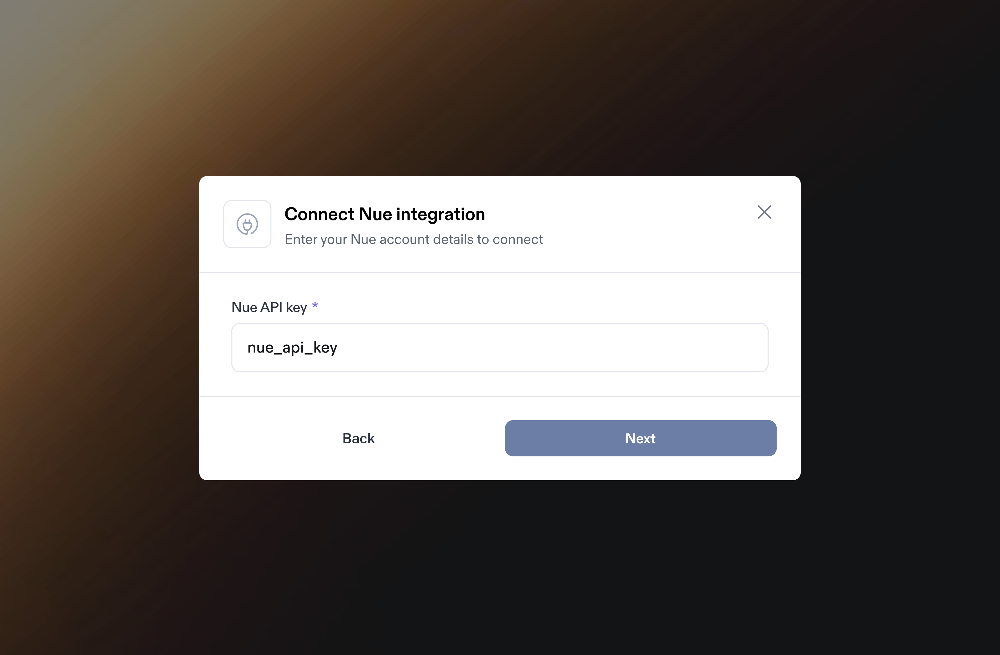
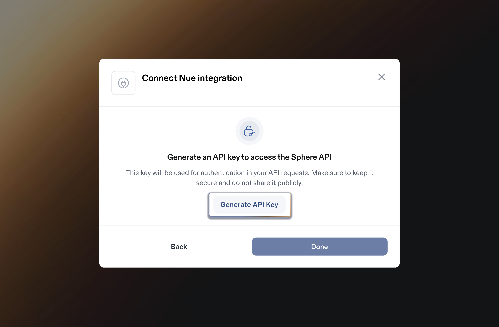

# Nue Integration

Integrating Nue with Sphere enables seamless transaction data import and live tax calculation within Nue.io quotes, orders, and invoices. &#x20;

This guide provides step-by-step instructions on generating an API key in Nue, linking it to Sphere for a secure integration.

It also covers configuring the Sphere Tax API within Nue.io to ensure accurate tax calculations.\
\
**Note:** If you are attempting to connect to a Nue sandbox, you will need to use a corresponding Sphere test organization.

### Part 1: Configure Data Synchronization from Nue.io to Sphere

1. In the Sphere account, click on the Connect button on the Nue tile.&#x20;

<figure><figcaption></figcaption></figure>

2. In another window, open your Nue.io dashboard and navigate to **System Settings** and click **API Keys**

<figure><figcaption></figcaption></figure>

3. Click the **+ New API Key** button and select the **System Administrator** assigned role

<figure><figcaption></figcaption></figure>

4. Once you click **Confirm** you will be able to see the API Key you created by clicking **Reveal**

<figure><figcaption></figcaption></figure>

5. Go back to your Sphere account and enter the API Key. Click **Next** to complete the data synchronization setup.

<figure><figcaption></figcaption></figure>

6. On the next step, you will be prompted to generate a Sphere API Key. Save this API Key for Part 2 below.

<figure><figcaption></figcaption></figure>

### Part 2: Configure Sphere Tax API Key for Tax Calculation

1. Navigate to **Settings → Roles** in Nue and ensure relevant admin roles have the **Sphere integration** permission enabled.

<figure><figcaption></figcaption></figure>

2. Navigate to Settings > Integration Overview > Sphere integration
   1. Locate the **Sphere** card; it will display as **Not Connected** for a fresh tenant.
3. Click on the Wrench to open configuration panel or go directly to Settings > Sphere
4. You will land on the **Connect to Sphere Tax** panel, which prompts for the API key and offers **Test** and **Activate** buttons.
5. **Enter and test Sphere API key**
   1. Paste the **Sphere API token** from Part 1 above into the token field
   2. Click **Test**:
      1. If the key is invalid, you’ll see an authentication error: “Integration authentication failed. Please verify API key.”
      2. Fix and re‑test until the connection succeeds.
6. After a successful test, click **Activate.**
   1. On success, the Sphere card status updates to **Connected/Active** and Nue will start routing tax calls to Sphere.
