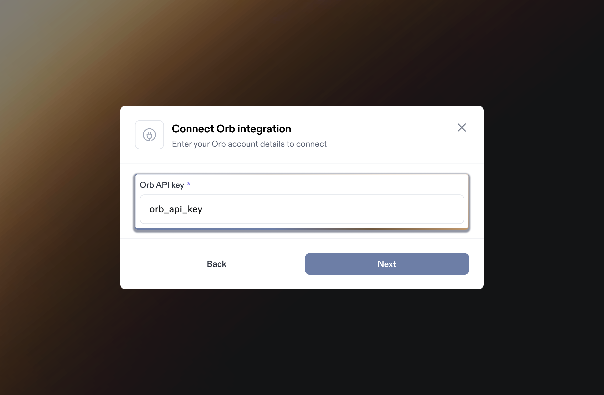
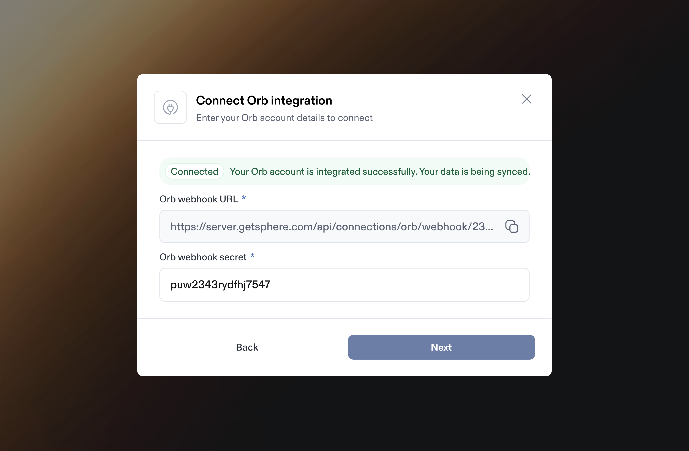
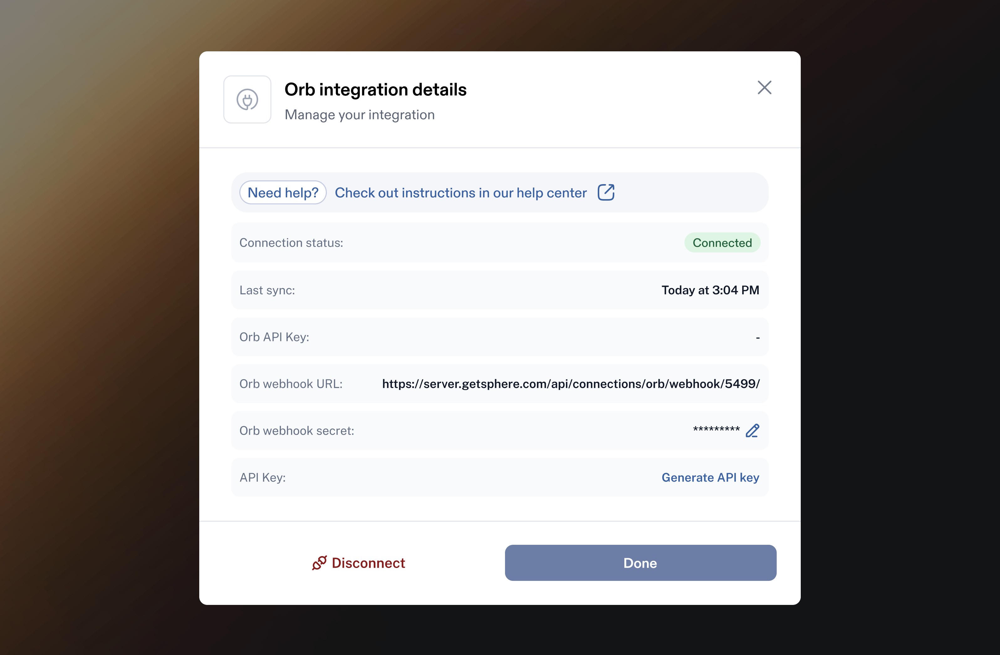
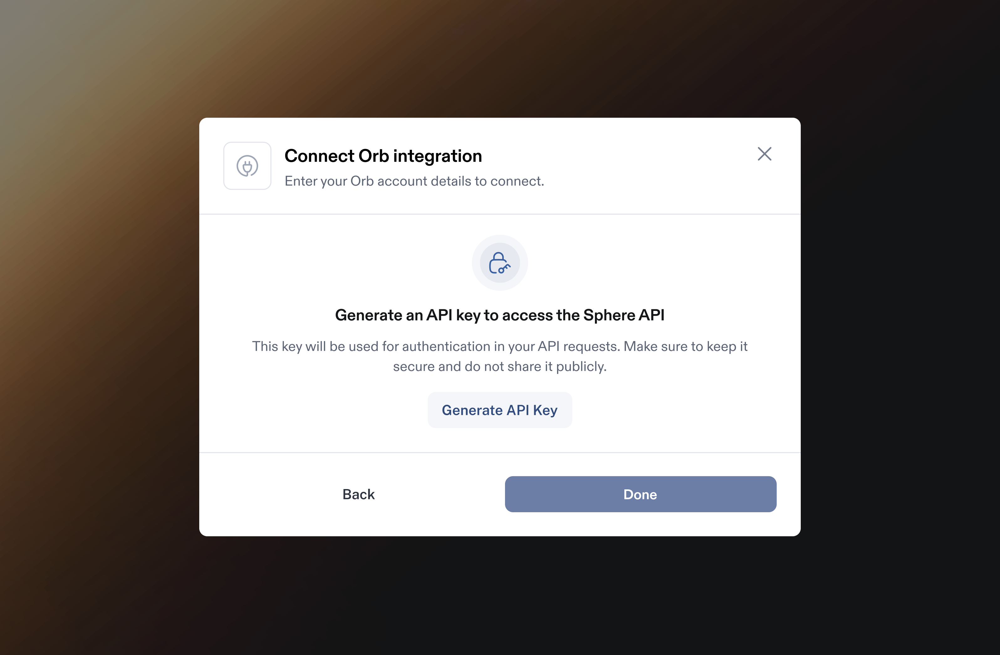
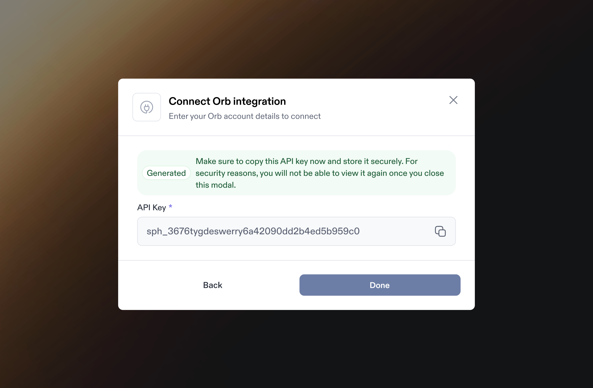

# Orb Integration

Integrating Orb with Sphere enables a.) seamless transaction data import and b.) live tax calculation within Orb invoices. &#x20;

This guide provides step-by-step instructions on generating an API key in Orb, linking it to Sphere for a secure integration, and setting up a webhook connection between the two platforms.&#x20;

It also covers configuring the Sphere Tax API within Orb to ensure accurate tax calculations.

### Part 1: Configure Data Synchronization from Orb to Sphere

**Note:** Ensure that the test mode flag is turned off in Orb and that you are in live mode.

1. In your Sphere account, click on the **Connect** button on the Orb tile.

<figure><figcaption></figcaption></figure>

2. In another window, open your Orb dashboard and navigate to the **Developers** tab. Click **API Keys**.

<figure><figcaption></figcaption></figure>

3. Click the **+ New API Key** button at the top.

<figure><figcaption></figcaption></figure>

4. A modal will appear allowing you to enter the **key name** and a **description**. Once finished, click **Create**. Leave all other settings as defaults.

<figure><figcaption></figcaption></figure>

5. A new key will be created. Be sure to save it, as you won’t be able to view it again.

<figure><figcaption></figcaption></figure>

6. Go back to your Sphere account and enter the API key generated in Step 4. Ensure there are no extra spaces before or after the value.

<figure><figcaption></figcaption></figure>

7. Click **Next** to complete the setup. A success message will confirm the connection. Next, you'll proceed with setting up the webhook. Copy the Orb Webhook URL.

<figure><figcaption></figcaption></figure>

8. Return to the **Orb Dashboard**, go to the **Developers** tab, and click **Webhooks**.

<figure><figcaption></figcaption></figure>

9. Click the **+ Add endpoint** button.

<figure><figcaption></figcaption></figure>

10. A modal will appear, prompting you to enter the **Endpoint URL** you copied from **Sphere** (Orb Webhook URL) in Step 7. You can either click **Select All** at the top of the screen to select all events, or **Select All** for both **Customer** and **Invoice & credit note**. Finally, Click **Create Endpoint**. 

    <figure><figcaption></figcaption></figure>
11. You will see the **Endpoint URL** successfully added to the list. Click the URL that was just added.

<figure><figcaption></figcaption></figure>

12. In the top right corner, expand the dropdown and click **View Signing Secret**.

<figure><figcaption></figcaption></figure>

13. Copy the **Signing Secret**. You will be pasting this value into **Sphere**.

<figure><figcaption></figcaption></figure>

14. Go back to the **Sphere dashboard**. In the **Orb Webhook Secret** input field, paste the **Signing Secret** copied in Part 13, then click **Done**.

<figure><figcaption></figcaption></figure>

15. You’re all set! If the connection is successful, data will begin importing, and after some time, your products will appear in **Sphere**.

<figure><figcaption></figcaption></figure>

However, if you've been following this guide, Sphere will automatically direct you to the API key creation screen, allowing you to immediately commence Part 2 (below). The screen you see is to generate the API key, simplifying Step 3.

### Part 2: Configure Sphere Tax API Key for Tax Calculation

1. Navigate to the settings in Orb and select the Integrations tab.

<figure><figcaption></figcaption></figure>

2. Locate Sphere tax in the Taxes section and click **"Connect Sphere"**.

<figure><figcaption></figcaption></figure>

3. In Sphere, click on "**Create a new API Key**" to generate the Sphere Tax API Key. Be sure to save the newly generated key, as it cannot be viewed again later.

<figure><figcaption></figcaption></figure>

<figure><figcaption></figcaption></figure>

<figure><figcaption></figcaption></figure>

4. Enter your Sphere Tax API Key into the text box and click **"Connect"**.&#x20;

<figure><figcaption></figcaption></figure>

5. After completing the setup, the connection status will be set to **Active**.

<figure><figcaption></figcaption></figure>

***

### Set up a connection between your Orb test account and Sphere

To integrate your Orb test environment with Sphere, begin by enabling **test mode** in your Orb account. You can do this by toggling the switch located at the top of the Orb dashboard.

**Note:** Before proceeding, please check with your Sphere representative to confirm that your Sphere test account is properly set up and aligned with your testing requirements.

Once test mode is activated:

* A **green notification bar** will appear across the top of the Orb dashboard, indicating that you are operating within the test environment.
* All data and operations within this mode will remain isolated from your live/production Orb environment, ensuring a safe testing experience.

After test mode is enabled, you can proceed to connect Sphere by following the same steps outlined above for production setup.

For more information on using Orb’s test mode and environment setup, please refer to the official [Orb documentation](https://docs.withorb.com/quickstart/introduction).

<figure><figcaption></figcaption></figure>

<figure><figcaption></figcaption></figure>
