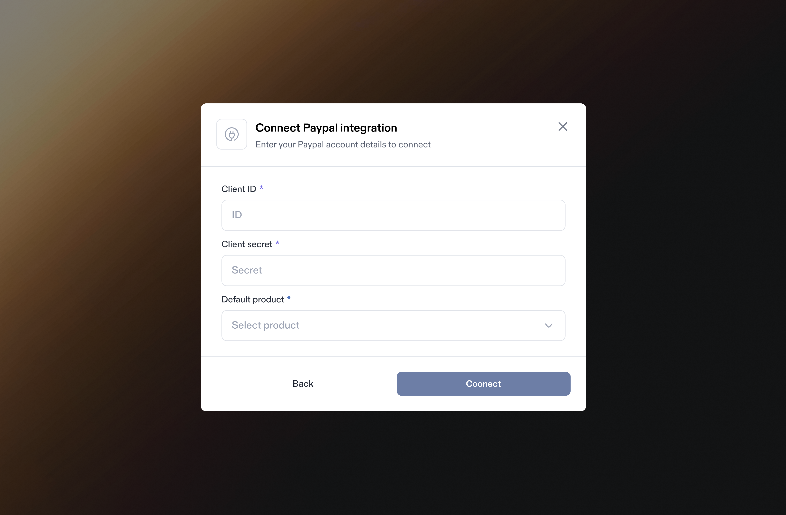

# PayPal Integration

Integrating PayPal with Sphere enables seamless ingestion of transaction data for **PayPal Checkout sales, payment reversals, and payment refunds**.

This guide provides step-by-step instructions on generating an API key in PayPal and linking it to Sphere for a secure integration.

Sphere does not currently support a direct live tax calculation integration with PayPal. Instead, we recommend using the [Sphere Tax Calc API](https://docs.getsphere.com/~/revisions/JeAvU6D68mrZkKZY8IsB/features/integrations/api/tax-calculation) to calculate tax for your PayPal transactions. Follow the instructions below to link customer address information between your Sphere Tax Calc API requests and your PayPal transactions.

**Note:** If you are connecting to a PayPal sandbox environment, you must use a corresponding Sphere test organization.

### Part 1: Configure Data Synchronization from PayPal to Sphere

1. In the Sphere account, click on the Connect button on the PayPal tile.&#x20;

<figure><figcaption></figcaption></figure>

2. Create a PayPal App
   1. In the PayPal Developer Console, navigate to Apps & Credentials in the sidebar.
   2. Click Create App and enter a unique name to identify the Sphere integration.
   3. After creating the app, PayPal will display the App Details, including the Client ID and Client Secret.
3. Connect PayPal to Sphere
   1. Return to your Sphere account.
   2. Enter the Client ID and Client Secret from the PayPal app you created above.
   3. Currently, we only support a single product for your PayPal transactions. Select the product you'd like to associate with your PayPal transactions from the dropdown.
   4. Click **Connect** to complete the data synchronization setup.

<figure><figcaption></figcaption></figure>

### Part 2: Configure Sphere Tax API for Tax Calculation

Please follow the guide here to use the [Sphere Tax API](https://docs.getsphere.com/~/revisions/JeAvU6D68mrZkKZY8IsB/features/integrations/api/tax-calculation) to calculate the tax to apply to your PayPal transactions.

To link customer address information to your PayPal transactions, we need a shared customer identifier across both your Sphere Tax API requests and your PayPal transactions. Please add your internal customer identifier to the `custom_id` field in your PayPal checkout requests and to the `customer_id` field in your Sphere Tax API requests.

