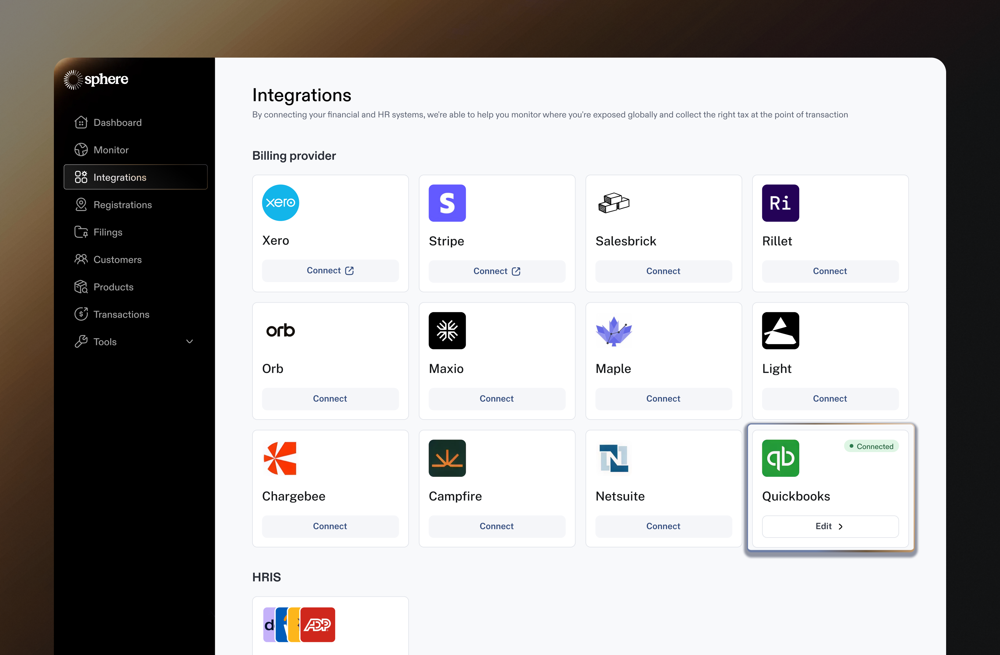

# QuickBooks Integration

Integrating QuickBooks with Sphere enables a) seamless import of transaction data and b) live tax calculation within QuickBooks transactions (invoices, credit memos and refund receipts).

This guide provides detailed, step-by-step instructions for connecting your QuickBooks account to Sphere using the secure OAUTH flow.

### Configure Data Synchronization from QuickBooks to Sphere

1. In your Sphere account, select the QuickBooks tile and click the “**Connect**” button.

<figure><figcaption></figcaption></figure>

2. You will be redirected to a QuickBooks OAUTH link, where you'll need to select the company to connect with Sphere. Please click Next after selecting the company.

<figure><figcaption></figcaption></figure>

3. After granting access, you'll be redirected back to Sphere, where you'll see that your QuickBooks account has been successfully connected.

<figure><figcaption></figcaption></figure>

4. You’re all set! If the connection is successful, data will begin importing, and after some time, your products will appear in **Sphere**.

<figure><figcaption></figcaption></figure>

### Tax Calculation in QuickBooks

### Pre-requisite for tax calculation in QuickBooks

1. Ensure that the Sales Tax feature is enabled in your QuickBooks account, as Sphere cannot apply taxes to your transactions without it. In the left navigation bar, search for **Taxes**, then click the **Sales Tax** settings button in the top-right corner.

<figure><figcaption></figcaption></figure>

2. Please make sure the Sales Tax option is enabled.

<figure><figcaption></figcaption></figure>

Note: If Sales Tax is disabled in your QuickBooks account, please reach out to your Sphere representative for assistance with enabling it.

### Next Steps

1. Ensure all your 'Subscribed Regions' in Sphere have 'Tax Calculations' settings switched to Yes (see video [here](https://www.loom.com/share/6254e72b130c44808a59513046ee60ea?sid=463c87f3-0683-4622-a479-0f960620d332) on how to ensure this is done).

<figure><figcaption></figcaption></figure>

2. You can create an invoice in QuickBooks for that region. After saving, refresh the page to see the taxes added to the invoice by Sphere. Since this process runs asynchronously, there may be a short delay before the taxes appear on the invoice.

### How to store Tax Ids in QuickBooks

Follow these steps to save the tax IDs linked to a customer in QuickBooks so Sphere can sync them.

1. Open the customer in QuickBooks and select **Edit**.

<figure><figcaption></figcaption></figure>

2. Click the **Edit Customer** button.

<figure><figcaption></figcaption></figure>

3. In the customer details, go to the **Additional Info** section and mark the customer as tax-exempt. This will reveal two fields: select **Other** as the exemption reason, and enter the tax ID in the **Exemption Details** field. Once complete, click **Save**.

<figure><figcaption></figcaption></figure>
