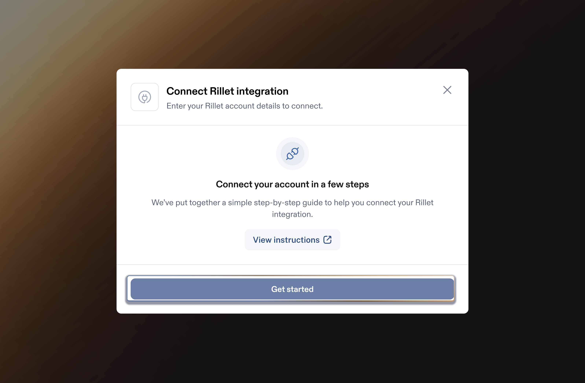
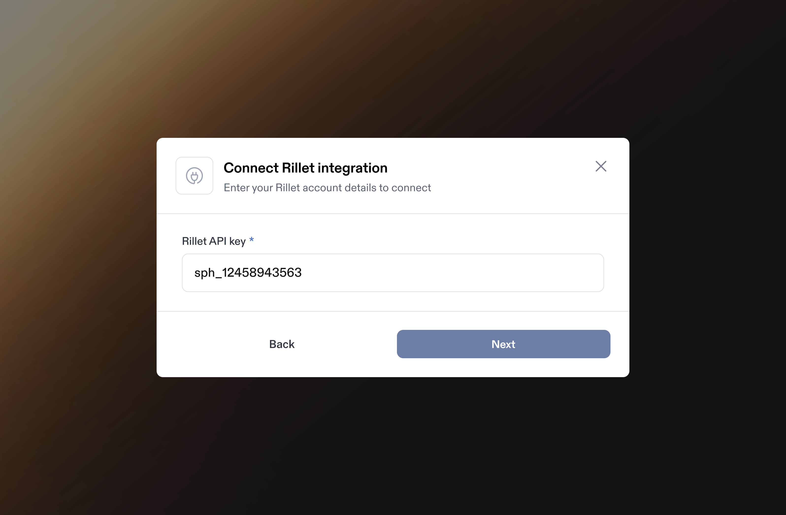

# Rillet Integration

Integrating Rillet with Sphere enables a.) seamless transaction data import and b.) live tax calculation within Rillet invoices. &#x20;

This guide provides step-by-step instructions on generating an API key in Rillet, linking it to Sphere for a secure integration.&#x20;

It also covers configuring the Sphere Tax API within Rillet to ensure accurate tax calculations.

### Part 1: Configure Data Synchronization from Rillet to Sphere

**Prerequisite:**\
**Note:** Rillet authenticates API requests using API keys. To get started, reach out to the Rillet team to enable access. Once enabled, you can create and manage your API keys from the [Organization Settings](https://app.rillet.io/settings/api-access) page.

1. In your Sphere account, select the Rillet tile and click the “**Connect**” button.

<figure><figcaption></figcaption></figure>

2. A modal will appear — click the **“Get Started”** button to proceed.

<figure><figcaption></figcaption></figure>

3. Navigate to your **Organization Settings** by clicking on your Rillet account name in the bottom left corner, and then clicking **Organization Settings**. From there, navigate to the **API Access** section ([https://app.rillet.io/settings/api-access](https://app.rillet.io/settings/api-access)) and generate a new API key by clicking on Create New API Key. Make sure to **NOT** select the read-only box.

<figure><figcaption></figcaption></figure>

4. Go back to the Sphere app, paste the Rillet API key, and click **Next**.

<figure><figcaption></figcaption></figure>

5. Select the Rillet subsidiary you want to associate with your Sphere organization. NOTE: If you only have 1 entity in your Rillet account it will be automatically selected for you and this step will be skipped.

<figure><figcaption></figcaption></figure>

6. Copy the **Rillet webhook URL** from the screen below

<figure><figcaption></figcaption></figure>

7.  In Rillet, navigate to **Organization Settings** > **Webhooks** ([https://sandbox.rillet.io/settings/webhooks](https://sandbox.rillet.io/settings/webhooks)) and click the **Create webhook** button.

    <figure><figcaption></figcaption></figure>

    1. Paste the URL from Step 6 to the URL field
    2. Under **Entity**, select:
       1. **Invoice**, and check the boxes for **Created**, **Updated**, **Deleted**, **Payment Updated**
       2. Click **Add Entity** right below
       3. Select the **Credit Memo** entity, and chec&#x6B;**:** **Created**, **Updated**, **Deleted**, **Payment Updated**&#x20;
    3. Click '**Create**'

<figure><figcaption></figcaption></figure>

8.  On the same page as the previous step, Click on the Webhook you just configured, and copy the '**Signing token**' into the **Rillet webook secret** field in the Sphere integration (in the page in Step 6)

    <figure><figcaption></figcaption></figure>
9. You’re all set! If the connection is successful, data will begin importing, and after some time, your products will appear in **Sphere**.

<figure><figcaption></figcaption></figure>

### Tax Calculation in Rillet

1. Ensure all your 'Subscribed Regions' in Sphere have 'Tax Calculations' settings switched to Yes (see video [here](https://www.loom.com/share/6254e72b130c44808a59513046ee60ea?sid=463c87f3-0683-4622-a479-0f960620d332) on how to ensure this is done).

<figure><figcaption></figcaption></figure>

2. You can go ahead and create an invoice in Rillet for that region. After saving your changes, taxes will be added to the invoice by Sphere through an asynchronous process. This might take some time, so they may not appear immediately.
