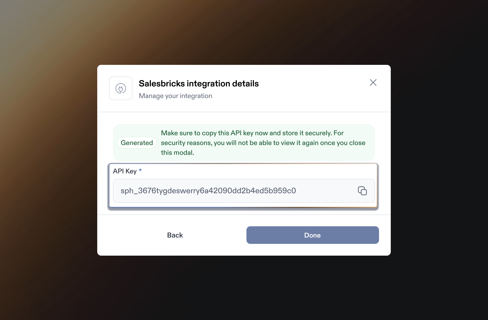

# Salesbricks Integration

Integrating Salesbricks with Sphere enables a.) seamless transaction data import and b.) live tax calculation within Salesbricks invoices. &#x20;

This guide provides step-by-step instructions on generating an API key in Salesbricks, linking it to Sphere for a secure integration.&#x20;

It also covers configuring the Sphere Tax API within Salesbricks to ensure accurate tax calculations.

### Part 1: Configure Data Synchronization from Salesbricks to Sphere

1. In your Sphere account, select the **Salesbricks** tile and click the “**Connect**” button.

<figure><figcaption></figcaption></figure>

2. A modal will appear — click the **“Get Started”** button to proceed.

<figure><figcaption></figcaption></figure>

3. In your Salesbricks app, navigate to the **Settings** tab, then go to **Integrations**. Under the **Salesbricks Services** section, click the **APIs** button.

<figure><figcaption></figcaption></figure>

4. Generate a new API token and copy it to your clipboard.

<figure><figcaption></figcaption></figure>

5. Go back to the Sphere app, paste the Salesbricks API token, and click **Next**.

<figure><figcaption></figcaption></figure>

6. You’re all set! If the connection is successful, data will begin importing, and after some time, your products will appear in **Sphere**.

<figure><figcaption></figcaption></figure>

### Part 2: Configure Sphere Tax API Key for Tax Calculation

1. In Sphere, click **“Create a new API Key”** to generate the Sphere Tax API key. Make sure to save the newly generated key, as it cannot be viewed again later. You will need to enter this value in the Salesbricks dashboard.

<figure><figcaption></figcaption></figure>

<figure><figcaption></figcaption></figure>

<figure><figcaption></figcaption></figure>

2. Go to **Settings** in your Salesbricks account, click **Integrations**, and then under the **Billing and Payment** section, select **Sphere**.

<figure><figcaption></figcaption></figure>

3. Paste the **Sphere API key** into the input field on this page and click the **Validate** button.

<figure><figcaption></figcaption></figure>

4. Once the key is validated, the connection status will show as **Active**. You’re all set.

<figure><figcaption></figcaption></figure>
