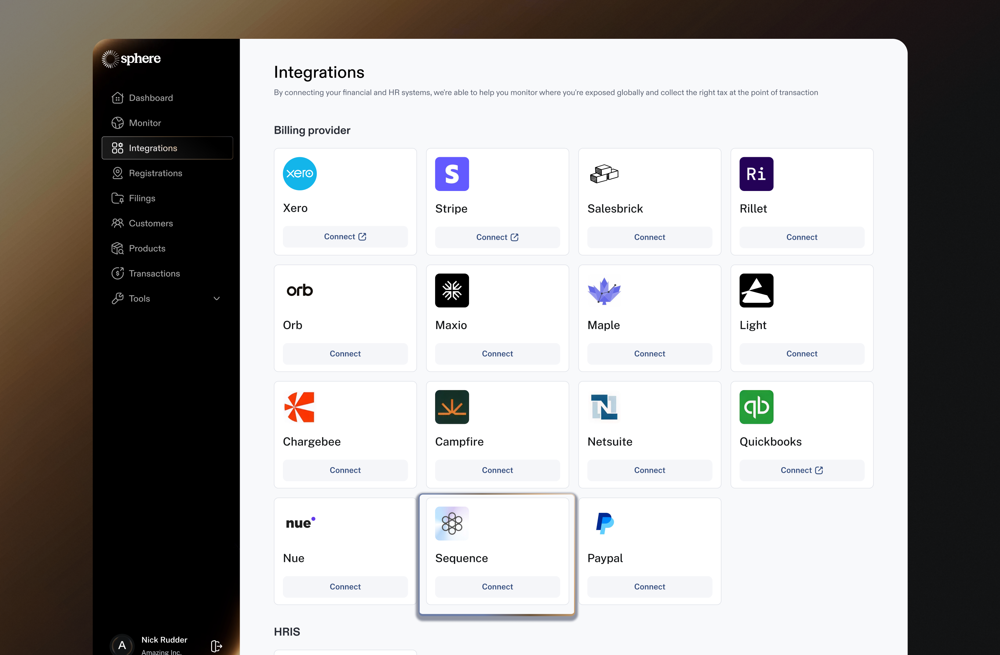
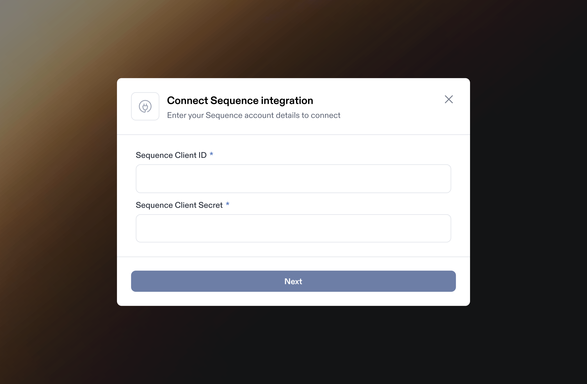
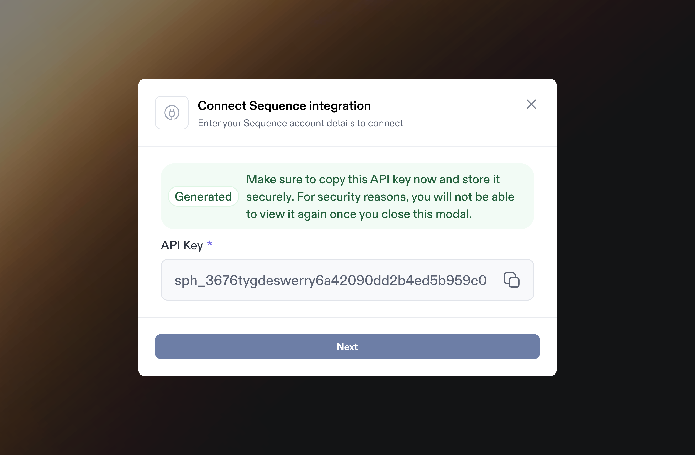

# Sequence Integration

Integrating Sequence with Sphere enables seamless transaction data import and live tax calculation within Sequence.&#x20;

This guide provides step-by-step instructions on generating an API key in Sequence, linking it to Sphere for a secure integration.

It also covers configuring the Sphere Tax API within Sequence to ensure accurate tax calculations.\
\
**Note:** If you are attempting to connect to a Sequence sandbox, you will need to use a corresponding Sphere test organization.

### Part 1: Configure Data Synchronization from Sequence to Sphere

1. In the Sphere account, click on the Connect button on the Sequence tile.&#x20;

<figure><figcaption></figcaption></figure>

2. In another window, open your Sequence dashboard and navigate to **Settings** and click **API Keys**

<figure><figcaption></figcaption></figure>

3. Click the "+New key" button and copy the ID and Client Secret values

<figure><figcaption></figcaption></figure>

4. Go back to your Sphere dashboard and enter in the Client ID and Client Secret from above&#x20;

<figure><figcaption></figcaption></figure>

5. On the next step, you will be prompted to generate a Sphere API Key. Save this API Key for Part 2 below.

<figure><figcaption></figcaption></figure>

### Part 2: Configure Sphere Tax API Key for Tax Calculation

1. Navigate to “Browse integrations”, locate Sphere in the Tax section, and click “Manage integration”

<figure><figcaption></figcaption></figure>

2. Enter the Sphere API key from Part 1 and click "Test credentials" to validate the key

<figure><figcaption></figcaption></figure>

3. Once the Sphere API Key is validated, click Save changes. Sequence will now start routing tax calls to Sphere.&#x20;

