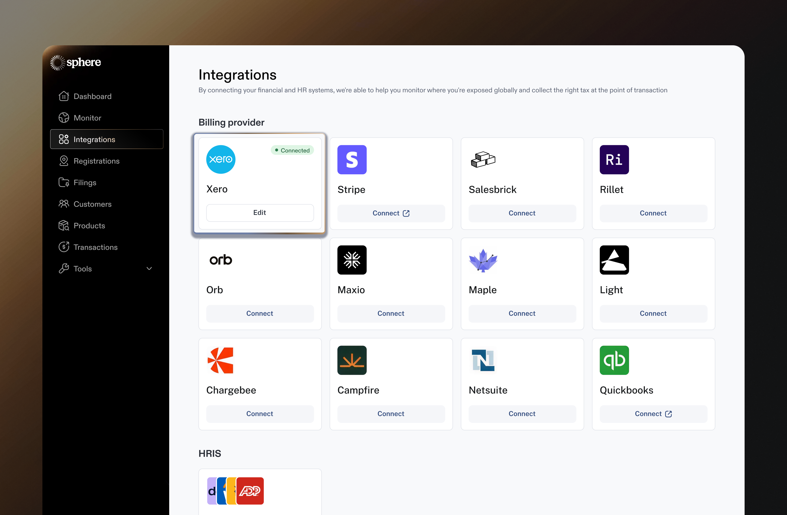

# Xero Integration

Integrating Xero with Sphere enables a) seamless import of transaction data and b) live tax calculation within Xero invoices.

This guide provides detailed, step-by-step instructions for connecting your Xero account to Sphere using the secure OAUTH flow.

### Configure Data Synchronization from Xero to Sphere

1. In your Sphere account, select the **Xero** tile and click the “**Connect**” button.

<figure><figcaption></figcaption></figure>

2. You will be redirected to a Xero OAUTH authorization link, where you'll need to grant Sphere permission to connect to your Xero account.

<figure><figcaption></figcaption></figure>

3. After granting access, you'll be redirected back to Sphere, where you'll see that your Xero account has been successfully connected.

<figure><figcaption></figcaption></figure>

4. You’re all set! If the connection is successful, data will begin importing, and after some time, your products will appear in **Sphere**.

<figure><figcaption></figcaption></figure>

### Tax Calculation in Xero

1. Ensure all your 'Subscribed Regions' in Sphere have 'Tax Calculations' settings switched to Yes (see video [here](https://www.loom.com/share/6254e72b130c44808a59513046ee60ea?sid=463c87f3-0683-4622-a479-0f960620d332) on how to ensure this is done).

<figure><figcaption></figcaption></figure>

2. You can go ahead and create an invoice in Xero for that region. Once you've saved your changes, refreshing the page will show the taxes added to the Xero invoice by Sphere. Updating credit notes with taxes may take some time — up to 15 minutes at most.

### Set up a connection between your Xero sandbox account and Sphere

To integrate your Xero sandbox (test) environment with Sphere, it’s crucial to **select the sandbox organization** rather than the live organization during the OAuth connection process. This ensures that all data and interactions occur within the safe confines of your test environment without affecting your production data.

**Note:** Before proceeding, please check with your Sphere representative to confirm that your Sphere test account is properly set up and aligned with your testing requirements.

The connection process to Sphere is the same—simply follow the steps outlined above for the production setup.

<figure><figcaption></figcaption></figure>
