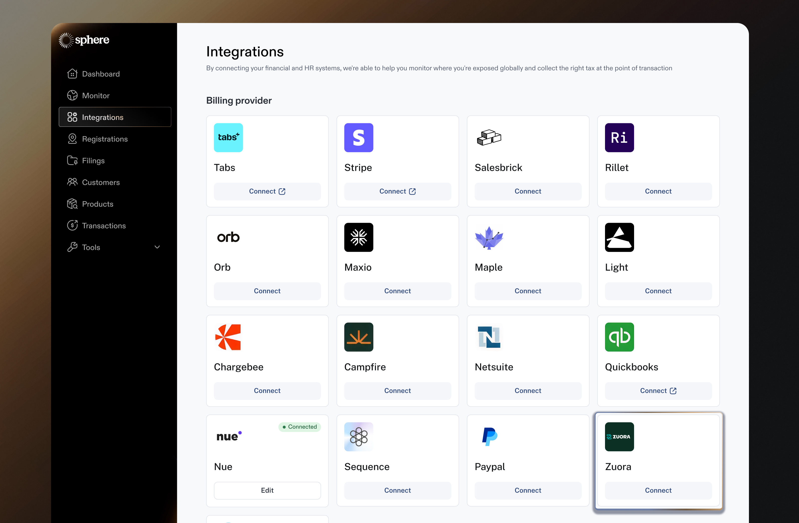

# Zuora Integration

Integrating Zuora with Sphere enables seamless transaction data import and live tax calculation within Zuora.&#x20;

This guide provides step-by-step instructions on generating an OAuth credentials in Zuora, linking it to Sphere for a secure integration.

It also covers configuring the Sphere Tax API within Zuora to ensure accurate tax calculations.\
\
**Testing:** To test the integration, we recommend connecting your Zuora sandbox tenant to a test Sphere organization to confirm. If you do not have Zuora sandbox tenant, please contact your Zuora account team to provision one.

### Part 1: Configure Data Synchronization from Zuora to Sphere

1.  In your Sphere account, click on the Connect button on the Zuora tile.&#x20;

    <figure><figcaption></figcaption></figure>
2. In another window, open your Zuora tenant and navigate to **Administration Settings** by clicking the Zuora App Settings icon on the bottom left corner.

<figure><figcaption></figcaption></figure>

3. Select **Manage User Roles** and Create a API User Role using the permissions below, if one is not already available in your account.

<figure><figcaption></figcaption></figure>

4. Navigate back to Administrator Settings and select **Manage Users** and Click the **Add Single API User** button

<figure><figcaption></figcaption></figure>

5. Fill out the Required information such as First Name, Last Name, and Work Email and select the API Role created above for the Zuora Platform Role field.

<figure><figcaption></figcaption></figure>

6. Once the API User is created, click into the new user and enter in a name for an OAuth Client and click **Create**. Keep the pop up open with credentials for the step below.

<figure><figcaption></figcaption></figure>

7. Navigate back to your Sphere dashboard, and enter in the Client ID and Client Secret from the OAuth Client created in the field below.
   1. For the Zuora environment dropdown, this will match the URL of your Zuora tenant
   2. For example, if your Zuora tenant URL domain is `na.zuora.com`, select `rest.na.zuora.com`

<figure><figcaption></figcaption></figure>

8. Once the integration is connected, click Edit and Generate a new API Key to be used below.

### Part 2: Configure Sphere Tax API Key for Tax Calculation

1. Open your Zuora tenant and navigate to **Billing Settings** by clicking the Zuora App Settings icon on the bottom left corner.

<figure><figcaption></figcaption></figure>

2. Select **Set Up Tax Engine and Tax Date.** Click the **+ Setup New Tax Engine** button and select **Sphere**

<figure><figcaption></figcaption></figure>

3. Fill in the fields on this screen as listed below:
   1. **Engine Name** -> Sphere
   2. **Tax Calculation URL** -> `https://server.getsphere.com/tax_api/zuora/calculate_tax`
   3. **Security Token** -> Paste the API Key generated in Part 1
   4. **Company Code** -> Enter in your Sphere Organization Name
   5. Under Request Templates, click the **Use Default Template** button

<figure><figcaption></figcaption></figure>

4. Navigate back to **Billing Settings** and select **Set Up Taxation Codes**

<figure><figcaption></figcaption></figure>

5. Click the **Add New Tax Code** button

<figure><figcaption></figcaption></figure>

6. Fill in the fields on this screen as listed below:
   1. **Tax Code Name** -> Sphere Tax Code
   2. **Tax Engine** -> Sphere
   3. **External Company Code** -> Your Sphere Organization Name
   4. Click **Save**&#x20;

<figure><figcaption></figcaption></figure>

7. Click **Activate** under the **Action column** for the Sphere Tax Code created

<figure><figcaption></figcaption></figure>

