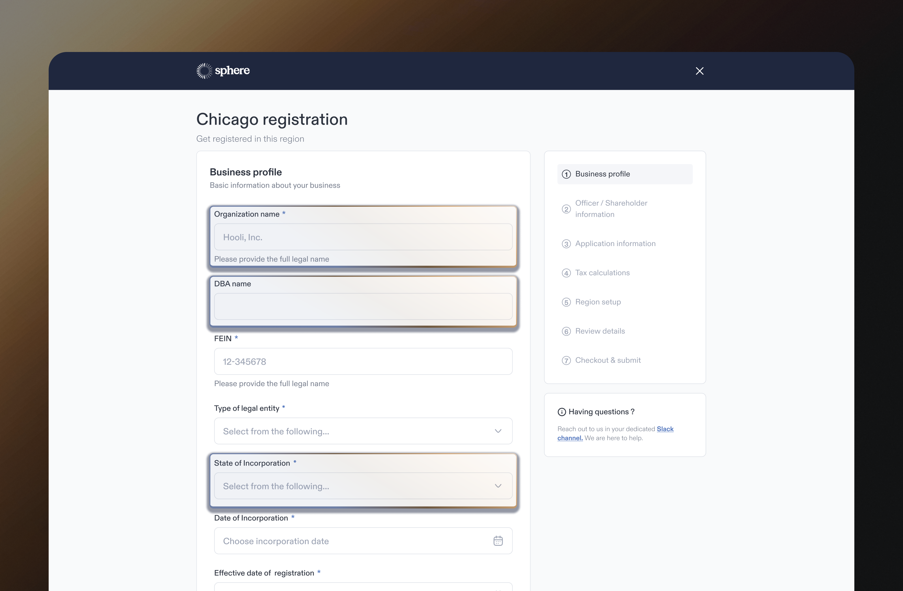
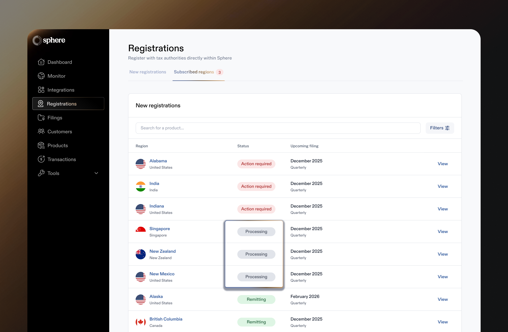

# Registration


Walkthrough of the Registrations feature in Sphere


## Overview

Our Registration feature allows you to apply for new registrations in regions across the world or submit your existing registration details so that Sphere can manage your account for you.&#x20;

Below we step through both new and existing registration flows.

## **New registrations**&#x20;

Sphere has gone through the registration requirements for each tax jurisdiction and has compiled all data required in its native registration forms.&#x20;

Every region will have different requirements and so forms may look a little different. That said, there is also significant overlap between forms - to help streamline registration, we prepopulate answers from prior registration forms that you've completed so that you don't have to fill out the same information every time.&#x20;

<figure><figcaption>
New registration forms are prepopulated with answers from prior registrations to save you time.
</figcaption></figure>


_Note: Many countries outside of the US offer a simplified GST / VAT system for digital services companies. Currently, Sphere only supports these simplified GST / VAT systems vs the general system in those countries. The limitations of these simpified systems tends to be that they don't allow you to claim input tax for expenses you incur in the region._


Once you submit a new registration, you will either need to:&#x20;

**a.) Complete some next steps** - if you need to complete a next step an 'Action Required' status will appear next to your registration in the 'Subscribed Registrations' table and you will receive email reminders until the tasks are complete.

<figure><figcaption>
'Action Required' status means you need to complete steps associated with the registration 
</figcaption></figure>

<figure><figcaption>
If you click on a region with 'Action Required' status you will see the steps you need to take to activate the region in the top right hand corner of the page.
</figcaption></figure>

**b.) Wait for your registration to process** - this means there are no next steps for you and the registration will have a 'Processing' status in the 'Subscribed Registrations' table. You just need to sit tight and Sphere will let you know what to do next! You will be sent an email notification once your registration becomes active or we need something from you.

<figure><figcaption>
'Processing' status means that Sphere is in the process of submitting your registration to the relevant tax authority 
</figcaption></figure>

## **Existing registrations**

If you are already registered in a region, all you need to do is link Sphere to your tax account.&#x20;

We make this easy for you by either requesting the relevant details Sphere needs to request access OR giving you instructions to provide access to Sphere.

<figure><figcaption>
Provide registration details
</figcaption></figure>

Similar to the New Registrations process, once you provide the necessary details to link Sphere to your account there may be some additional steps you need to take. If there are additional steps, the region will have an 'Action Required' status (as described in the New Registration section above).

## Autofiling and Tax Calculations&#x20;

Once your region becomes active on Sphere:

* **Autofiling** - will be turned on for the region by default; this means we will automatically generate filings for this region two weeks before the filing due date.&#x20;
* **Tax Calculations** - needs to be switched on if you plan to use Sphere as your real-time tax calculation provider. If you are using an alternate tax calculation provider, make sure this is switched off for the region.

You can switch on / off both Autofiling and Tax Calculations on each respective region page.

<figure><figcaption>
You can turn Autofiling and Tax Calculations on / off on each region page.
</figcaption></figure>
